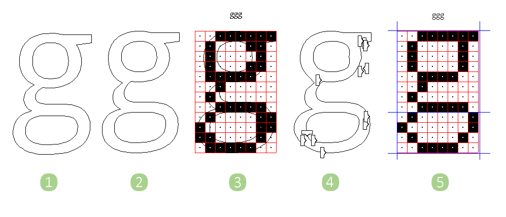
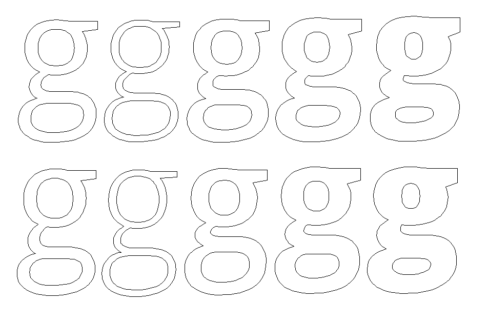

**Respecting the outlines**

_Notes on Hinting Variable fonts in Visual TrueType (VTT)_
 
_By Mike Duggan_
 
_This article is a companion piece to the more detailed how-to-vtt tutorial_
 
The terms ‘hinting’ and ‘distorted outlines’ often get used together, in descriptions of what hinting is and how it works. This has given ‘hinting’ a bad rap! In olden times, when screens could only render monochrome or greyscale letterforms, it was often necessary to distort the outline of a glyph at a specific size, to achieve the perfect bitmap shape.
 
A global set of hints was first added, to control the alignment and overall shape of an individual glyph. These global hints applied to all sizes of a glyph, however there were individual sizes where the pixel pattern produced by the hinting, required adjustment. 
 

**Older Hinting and Distortion**
 
1. Original outline
2. Hinted outline
3. Bitmap shape from scaled hinted outline (2)
4. Hinted outline at 15ppem distorted by ‘Deltas’, to correct bitmap shape. This distorted outline was never seen, only the bitmap (5) was displayed when the font was rendered on -screen
5. Corrected bitmap
 
Additional ‘delta commands’ were added at specific sizes, to clean up the pixel pattern. A ‘Delta’ is used to move control point a set number of pixel(s), based on the ppem size. Each ‘Delta’ only applied to a particular size, distorting the outline at that size to either turn individual pixels on or off.
This distorted outline, _(at this particular pixel per em size)_ looked ugly, but the bitmap shape was perfect, which was the desired goal. When the font was rendered on-screen, the distorted outline was never displayed, only the bitmap was seen.
 
**New Hinting**

**Top:** Original outline lowercase ‘g’, Open Sans Variable font, as shown in VTT

**Bottom:** Hinted outline, with one set of hints to control all weight variations. Note how close the hinted result is to the original outline with no distortions.

As screens and rendering have improved, the idea of distorting outlines is no longer relevant. Hints in Variable fonts are global, apply to all sizes and variations, and local hints to the outlines such as ‘Deltas’ cannot be used. Because of the way they are constructed, with full point compatibility, Variable fonts are a good fit for this style of hinting, with one simple set of hints for each glyph, used to control all of the Variation instances.

When reviewing the hinting in a Variable font, the original high resolution outline design should be considered the ‘gold standard’. Comparing the grid-fitted or ‘hinted’ outline to the original high-resolution outline, there should never be any obvious distortion to the outlines. Hinted outlines should be an accurate as possible translation from high resolution, _(the original outlines)_ to low resolution, the screen environment. The hinted outlines should adapt to the pixel grid as gracefully as possible.
 
The closer the hinted outlines match to the high-resolution outlines shape, the better the overall results will be when the font is rendered on-screen. Hinting code should be concise, and precise, correctly constraining and subtlety adapting the outlines to the pixel grid, using a combination of simple hinting instructions, and accurate rendering.
 
**Leveraging the VTT Autohinter**
 
As well as Variable fonts, only needing a lighter style of hinting, the VTT Autohinter can now do much of the work of adding the basic hinting needed to control the global features a Variable font.

This is a big win, significantly speeding up the hinting process, and saving a huge amount of tedious receptive work. By leveraging the power of the Autohinter, the task of hinting a Variable font, is much less daunting.
 
**Hinting Variable fonts**
 
**Primary approach** _(90% of the way)_
 
**Global Hints**
 
VTT is designed to allow for hinting of variable fonts. The primary hinting approach, _(described in detail in the how-to-vtt tutorial)_ has been refined to be as simple as possible, for accurate and elegant rendering of Variable fonts. 

Review the overall hinting as follows
 
- Autohint the font, and review the overall code output in each glyph
- Beginning with control characters, ‘H’ & ‘O’, ‘n’ & ‘o’, ‘0’ & ‘1’, establish that the hinting is correct, and use this as a basis to expand out to the larger glyph set.
- Review hinting for Upper / Lower / figures, editing, adding interpolations, and or re-hinting if necessary
- Review basic hint structure, for each glyph, checking heights and CVT assignments, and ensure a consistent hinting approach.
- Add global deltas in cvt table to adjust heights and proportions if necessary and applicable.
 
**The global primary approach uses three basic hinting commands**

- **ResYAnchor:** Control common shared heights using cvt’s as a reference
- **YShift:** Control stems, using the original outlines measurement as a reference, and rounding to fractional pixels.
- **YInterpolation:** Correctly position points at vertex positions, in the hinted outline, between hinted parent points.
 
**Autohinter default output**

The Autohinter output uses as default the ‘ResYDist’ command to control the weight of horizontal stems. The function that is called by the ‘ResYDist’ command in the current implementation in VTT, has an unfortunate effect of rounding very light outlines, _(horizontal rounds and stems),_ to one full pixel. This causes a very obvious distortion in lighter Variation Instances. In the system described in the how-to-vtt tutorial, this ‘ResYDist’ command is replaced by the ‘YShift’ command. Using the ‘YShift’ command restores the outlines to a more natural rounding. 

_Each font can be reviewed with this in mind, and the appropriate or preferred method used._
 
**Sweating the Details (the final 10%)**

A new font can take years to design and develop. Spending some additional time, to this process, to get the hinting as good as possible, as a final step, can be a worthwhile investment, to ensure the font will display as well as possible on lower resolution screens. 

There are always details in any autohinted font, that need attention. Autohinters are not perfect. The results from the Autohinter in VTT are generally good, and get you a long way towards a fully hinted Variable font. The results however are not perfect, and nowhere near what a professional typographer can achieve. It is good to think of the Autohinter as still only one piece of a system that still very much includes manual adjustments, and refinements by a human. 

There are also some key instructions missing from the current VTT Autohinter output, and as such, the output cannot be considered in any way final. Interpolations for example, which are key instructions, are not added, so editing is still required to add these instructions.
 
The beauty of VTT is that it allows for easy and detailed editing and proofing of the hinting code, so that important details of the font can be addressed in an efficient manner.

**The Details**
- Fine tune all glyphs, adding shift and interpolations where necessary.
- Hint special characters such as accents to ensure clarity
- Take special care with more complex glyphs, such as currency symbols with double bar horizontals, re-hinting from scratch if necessary
- Review all composite glyphs to ensure accents are positioned correctly and clear of base glyphs, with no clashing.
 
_Please refer to vtt-how-to tutorial for comprehensive overview of the process._
 