# how-to-vtt
A how-to guide to TrueType hinting variable fonts, with Visual TrueType

_by Michael Duggan_

_“The glyphs look like crisp pixel sculptures with lots of detail!”_ — Erik van Blokland

Feedback from client on a VTT Hinted Variable font

## Introduction
Font Hinting has always been thought of as a ‘black art’ - some magic performed behind the scenes, hard to understand, and very difficult to do. This was true when [hinting was done for low resolution screens](https://docs.microsoft.com/en-us/typography/truetype/fixing-rasterization-issues) and for older font rendering techniques, such as black and white or monochrome rendering. These older techniques required a lot of hinting code to ensure every feature in the font was strictly controlled and a consistent and clear on-screen display was maintained. This made hinting an _extremely_ time-consuming and skilled task, for specialists only. In addition, hinting was often a manual process, involving writing and editing thousands of lines of TrueType code by hand.

The good news is that this is no longer the case. As screen resolutions and font rendering have improved, hinting has become a lot less complicated, with only a handful of hinting instructions needed for each glyph, to ensure consistent and beautiful rendering on-screen. In addition, VTT’s built in autohinter significantly speeds up the process, leaving the focus on editing and fine-tuning the hinting to achieve the best results.

**VTT (Visual TrueType)** [Install](https://aka.ms/vtt-mst)

Microsoft Visual TrueType is a software tool for viewing, editing, and adding hinting instructions to the outlines of TrueType and OpenType/TTF fonts. You use Visual TrueType after creating a font in a font editor or after converting an existing font to the TrueType format.

VTT has been upgraded to handle all aspects of hinting for variable fonts. The following tutorial will go into detail on all of the steps you will need to use VTT to automatically add, and then fine tune, the hinting for variable fonts.

## Background / Older Font Hinting

In digital fonts, each character or glyph is described by a set of outlines. For older methods of font rendering, when the outline was scaled to a small size and rendered onto a coarse grid of pixels, each pixel whose centre lay within the outline was set to black. This scale and fill method never produced good results, bitmap shapes were irregular, glyph stems became uneven, spacing was not controlled, and individual glyph shapes were poor.

A set of instructions known as [hints](https://docs.microsoft.com/en-us/typography/truetype/hinting), solved this problem helping to translate a typeface’s high resolution outlines to the coarse pixel grid of a screen. To ensure even and easy to read text, every feature of the font outline and metrics, was controlled through hinting code, including spacing, symmetry, stem consistency, individual glyph shape, proportion, and overall typographic colour. Special instructions called ‘deltas’ were often used to even further refine a glyph’s shape, turning individual pixels on or off at a specific point size on-screen. 

Achieving perfect results, however, required expert hinting knowledge, a huge amount of code, and months of painstaking detailed work. 

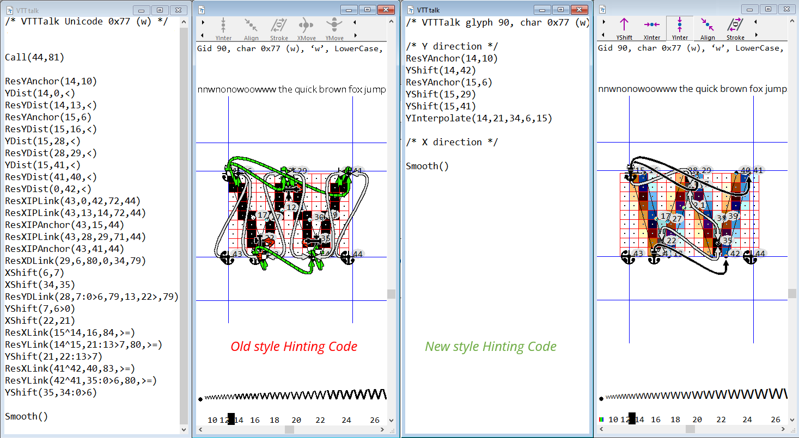

**Left** _(Older autohinting code)_ Hinting intended for black and white rendering. Code is added to control every aspect of the glyph for on-screen rendering. X-direction code was required to control, spacing, proportion, symmetry, diagonal control, alignment and glyph shape. Additional deltas would be needed to clean up the appearance of the glyph for perfectly symmetrical display in black and white.

**Right** _(New style hinting)_  Greatly reduced hinting instruction set, controlling x-height alignment and interpolation. The ‘x’ hinting code that was required in the horizontal direction is no longer needed, and instead the rendering is done from the font outline using DirectWrite subpixel rendering.

## Hinting and New Rendering 

Most modern browsers and common rendering environments, such as Microsoft Office on Windows, now have full support for the latest DirectWrite rendering engine. VTT also has the DirectWrite font rasterizer built in. This allows you to proof the hinting of a variable font in the VTT Tool, without having to install the font to test the hinting results. While working in VTT, you can maintain a high level of confidence that the hinted results will be replicated in the real world, in browsers and applications that use DirectWrite as their default. Proofing is also strongly advised, on the fully hinted font, in intended target browsers and applications.

**Key Features of [DirectWrite font rendering](https://docs.microsoft.com/en-us/windows/win32/direct2d/direct2d-and-directwrite#glyph-rendering)**
 
**Subpixel Positioning**
 
When DirectWrite renders a font’s spacing, glyphs can now begin on a subpixel boundary. [Subpixel positioning](https://docs.microsoft.com/en-us/windows/win32/directwrite/introducing-directwrite#improved-text-rendering-with-cleartype) greatly improves the spacing of type on-screen, especially at small sizes. The spacing accuracy that can be achieved by starting a glyph’s spacing on a subpixel boundary is significant compared with starting on a whole pixel as in GDI. This more accurate spacing is critical in achieving a smooth flow and even typographic colour to the text. 

Hinting is no longer needed to control the font’s spacing, which in the past required a lot of extra code and time to complete. This speeds up the hinting process significantly. 
 
**Horizontal and Vertical anti-aliasing**
 
Subpixel rendering improved the horizontal aspect of type on-screen but not the vertical. Older types of rendering, such as ClearType in Windows GDI for example, only supported horizontal anti-aliasing. This meant that aliasing or ‘jaggies’ were still very apparent at larger sizes on-screen. In order to fix this problem and give a smoother vertical effect, DirectWrite applies [anti-aliasing in the y-direction](https://docs.microsoft.com/en-us/windows/win32/directwrite/introducing-directwrite#improved-text-rendering-with-cleartype) in addition to using the horizontal subpixel rendering. 
 
The addition of support for vertical anti-aliasing, helped a great deal in smoothing out the appearance of text on-screen, particularly at larger sizes. However, for smaller font sizes, when a font’s outlines are scaled and rendered with no hinting, the vertical anti-aliasing can result in significant blur, particularly for horizontal features. 

By aligning key heights and horizontal features to the pixel grid, hinting can greatly reduce this blur, in particular for text reading sizes, on lower resolution screens.

**Hinting Benefits for today’s common rendering environments**
 
**Alignment of key heights**

The main glyph heights (such as capital, x-height, figure, ascender, descender) are controlled and kept consistent on-screen for all sizes, across all variations and styles of a variable font.

**Sharp rendering of horizontal strokes and alignment zones**

A simple set of hinting instructions fits horizontal features of the font outline to the pixel grid, significantly reducing blur. 
 
**Maintaining correct distances**

This allows all the details in all glyphs to be rendered clearly on-screen across all variations. For example, accented glyphs are hinted once to be a minimum of two pixels in height, if needed, and to be at least one pixel clear of the base glyph, for all variations. This ensures readable text across all variations, allowing for open and clear rendering on-screen, and for the details of the font design to be maintained down to the smallest text sizes.  

Glyphs with a complex outline structure can also be made to render clearly on-screen.

**Examples: Benefits of Hinting / Open Sans Variable / DirectWrite rendering**

**Alignment and blur reduction**
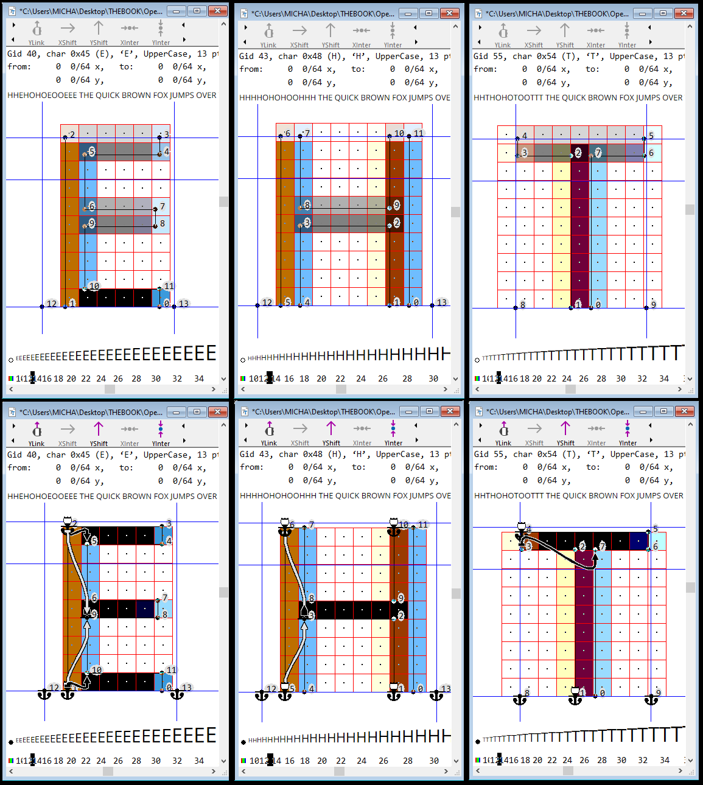

**Top:** Scaled un-hinted outlines, at 13ppem/10 point @96dpi, results in blurry horizontal features. _(Open Sans Variable font, default, Regular weight, ‘E’, ‘T’, ‘H’)_

**Bottom:** Hinted outlines. Reduces blur by fitting horizontals to the pixel grid. _(Shown with VTT Visual Hinting)_

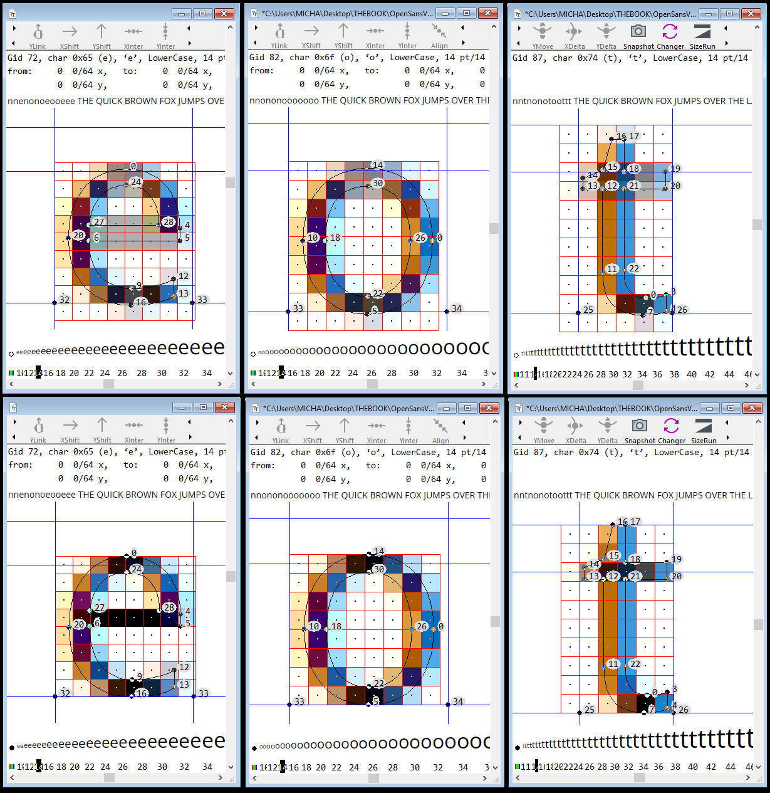

**Top:** Scaled un-hinted outlines results in blurry horizontal features. _(Open Sans Variable font, default, Regular weight, ‘e’, ‘o’, ‘t’)_

**Bottom:** Hinted outlines. Reduces blur by fitting horizontals to the pixel grid.

**Maintaining Distances**

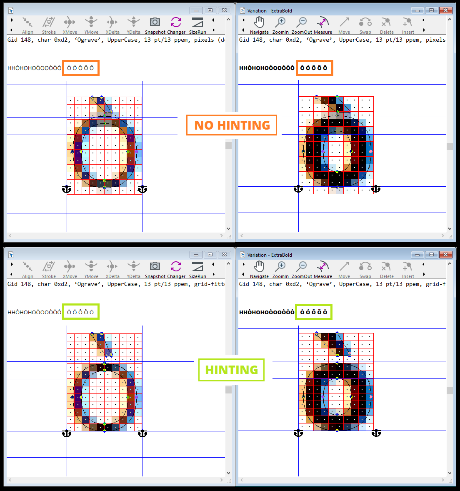

**Top:** Accented glyphs, at 13ppem/10 point @96dpi. Accents lose details and blur together with the base glyphs, resulting in loss of legibility. _(Open Sans Variable font, default, Regular weight, and Extra Bold Variation.)_

**Bottom:** Hinted accent. Accents are hinted to preserve the correct shape and to maintain a consistent height. A minimum distance is maintained between the base glyph and the accent for all variations.

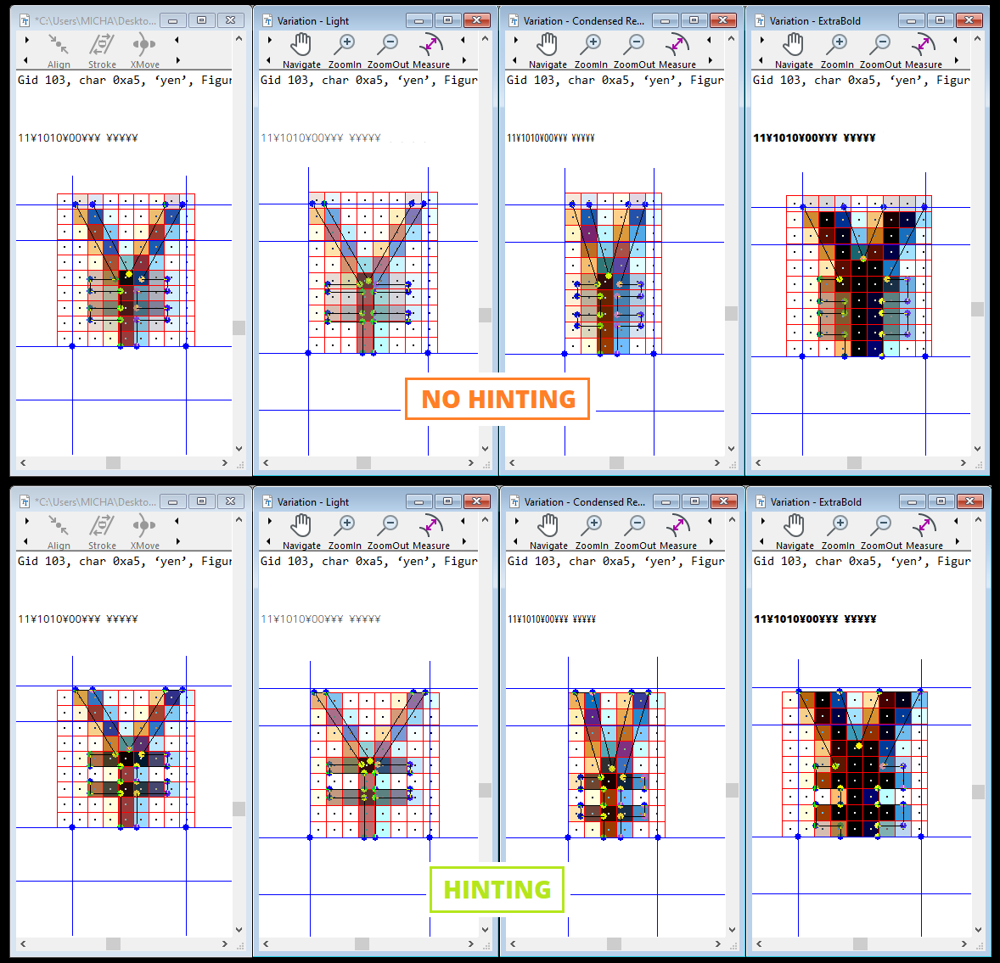

**Top:** Scaled un-hinted outlines of complex glyph outlines results in blurry horizontal features.

**Bottom:** Hinted outlines reduce blur by fitting horizontals to the pixel grid, while also preserving the internal white space, allowing for clear display on-screen.

## VTT Design Space Setup

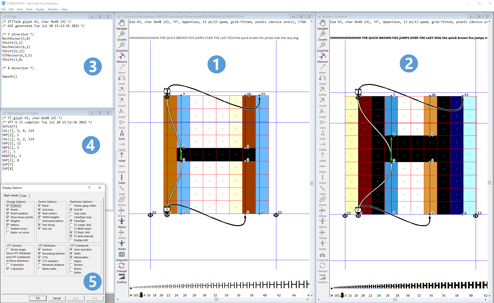

Hinting, editing, and proofing a Variable font in VTT is detailed work. It is helpful to have the workspace in VTT set up to a consistent and comfortable view. Becoming familiar with the tools, info, settings, and options will help you get the most out of VTT, and will streamline the hinting process. 

This example window setup _(Open Sans Variable font)_ shows the main windows (1-4) needed to view and edit the hinting, proof the results, and see the visual representation of the hinting (1 & 2), as well as the hinting code associated with each glyph. (3 & 4). Display Options (5) will not appear during the workflow when set.

> **Pro Tip** On opening a Variation Font, you can arrange the Windows in VTT to suit your own workflow. Saving the Window arrangment is an important part of that workflow as you will want the font to open with the same Window configuration, when resuming hinting. To save the Window configuration, make any change that requires a ‘Save’. For example, add or edit hinting on any glyph, using the Visual Hinting tools in the Main Window and ‘Save’, or simply, with the VTTtalk window selected, type and then delete some text, anywhere in the window, and then ‘Save’. `ctrl + s`. This will save the VTT preferences. The next time a font file is opened in VTT you will see the same window configuration.

**NOTE:** _Refer also to the extensive help file in VTT for additional information on setup, proofing, Hinting basics, tools, Autohinting, and Variable fonts_

**(1) Main Window _(View > Main View or `ctrl + 1`)_**

Hinting is done in the Main Window _(as previously for static fonts in VTT)_ on the default instance of the Variation font. Variable fonts are a way of accessing many font instances stored in one font file, but only one set of outlines needs to be hinted: the default instance. 

With both the Main and Variation windows showing side by side, viewing and editing the hints of the default instance of the font is done in the Main Window. The hinting will update live in the Variation window. Because hints in a variable font are associated with the default instance and other instances merely use interpolated CVTs (control values), you can only edit hints, on the default instance, in the Main Window.

The Variation Window can be used to proof the hinted results of any available instance in the font. When the Variation window is highlighted, choose, Display Menu > Variations Instance > Choose Variation, Light Bold, Condensed Light etc. or use keyboard shortcuts. (`ctrl + shift + up arrow / down arrow` is a quick and convenient way to toggle through the available variations in the font)

**(5) Display Options _(Menu > Display > Options or `ctrl + D`)_**

Display options settings determine how the glyph view and live text in the Main Window and Variation Window is displayed. To ensure that hinting and proofing is set correctly to show DirectWrite rendering, use the following settings shown under the ‘Rasterizer Options’ Tab:

**ClearType** 

**CT fract. AW _(subpixel positioning)_**

**CT anti-aliased _(y-smoothing)_**

These settings will be reflected in the Main View of the current glyph, the text samples in the size ramp at the bottom of the Main View, and in the sample text string at the top. _(The sample text string can be customized in `Tools>options>Text Sample> Extra Text`.)_

Other settings can be configured to how best suits your own working style. 

**Useful settings tips**

`Display > Options > Design Options` >  **Show fewer points.**

Showing fewer points will hide all off curve points which are not generally needed when hinting. This also allows for a much clearer display of the glyph outline in the Main Window, while hinting.

`Display > Options > VTT General` > **X-direction**

Set x-direction to off, as x-hinting code is not used

`Display > Options > VTT Attributes` > **Show CVT numbers.** 

Showing cvt numbers allows for easy visual proofing of the hinted glyph in the Main Window, for example to quickly determine whether the correct CVTs are used for setting heights.

**Glyph Info Bar _(Top of Main Window)_**

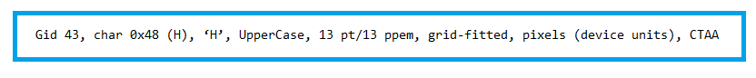

While viewing any glyph in the Main Window, the glyph info bar will display the following information:

**GID number:** The Glyph ID for the currently selected glyph, in the sequential order the glyphs are stored in the font file. 

> **Pro Tip:** The glyph order can be displayed in two ways, under `Tools > options > settings > Access glyph by Index`. When this checkbox is set, the character set (`ctrl-9`) will show the glyphs as they are ordered in the font file. It is useful to leave this as the default setting, as the hinting for every glyph in the font should be proofed and checked. If this option is unset, only glyphs with Unicode codepoints assigned will be shown. This is also a useful view, however if set as the default, some glyphs may be missed in the hinting and proofing process.

**Char:** If the glyph has an associated Unicode, this will be shown, e.g.: Cap H (0x48). If there is no Unicode associated with the glyph, this will be shown as Oxffff _(OpenType glyphs such as Small Caps, figure styles or ligatures, for example). Unicode is followed by the Glyph name.

**Uppercase:** Character group information for each character. The character group tells VTT which group of values to use from the Control Value Table.

**pt / ppem** Currently selected point/ppem size reflecting the selected resolution. 

The resolution to display the text string and waterfall run in the main window can be changed, `Display > Resolution > choose desired resolution`. This is useful for proofing at both lower and high resolutions). 

Choose the size to view in the Main window, `Display > Size > ...`, or click on a size from the text ramp at the bottom of the Main Window. Use up and down arrows to change the point size, or `ctrl + equals`, and enter the desired size.

**Note on setting the resolution:** While hinting and proofing in the Main Window and in the Variation Window, it is recommended to set the resolution to 72dpi. This allows for proofing of all sizes. When adding or editing the visual hinting, setting the size to a lower ppem _(in the range of 9 - 16ppem),_ is a good method to best view the effects of the hinting. Use (`ctrl + g`), to turn hinting on and off. 

**grid-fitted:** Showing if hinting is turned on (grid-fitted) or off. To toggle between the two states use `ctrl + g`. 

> **Pro Tip** `ctrl + g` is worn out on my keyboard. While adding hints or reviewing and editing the autohinter code, `ctrl + g` switches between hinting and no hinting. It is critical to always keep the original outline in mind, _(no hinting)_ to ensure that there is minimal distortion between the two states. 

The hinted outline should not vary too much from the high resolution design in proportion and shape, and there should be no obvious distortions.

**Pixels:** pixels on / off `ctrl + b`

**CTAA:**  Showing the current anti-aliasing settings, as chosen in `Display Options > Rasterizer settings` _(**CTAA:** ClearType anti-aliased, **GS:** Grey Scale)_

**Toolbar**

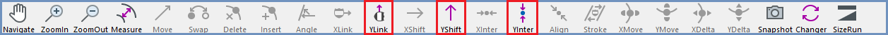

Shown here in the main window set to the left. _(Refer to the VTT Help file for more detailed explanations on using each tool. The Toolbar can be configured to show on the top, left, right, or bottom of the Main Window using `Tools>Options>Appearance>Location`)_ 

**Note:** The ‘Move’, ‘Swap’, ‘Delete’ and ‘Insert’ commands in the Main Window UI Toolbar are disabled in VTT for Variable fonts. Making any changes to the outlines with these commands would break a Variable font. 

Navigate / Zoom in / Zoom out 

> **Pro Tip** _Using a wheel mouse for zooming in and out is a must for a smooth workflow. Zooming in to inspect details, in particular, is a common task during the hinting workflow._

**Measure**

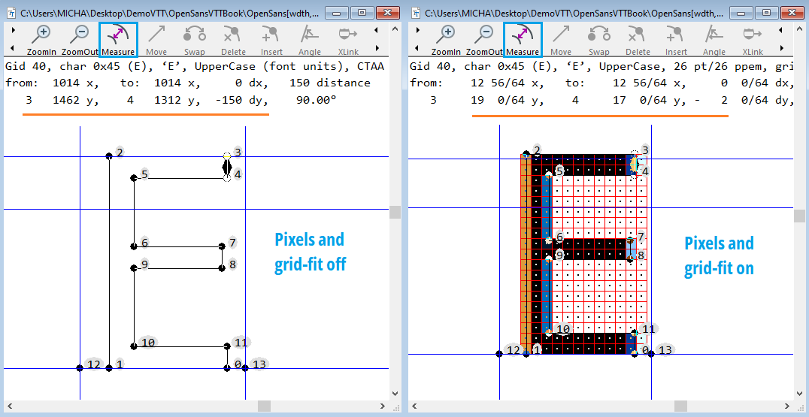

**Left:** When Grid-fit and pixels are turned off the measuring tool will measure distances on the original outline design.

**Right** When Grid-fit and pixels are turned on the measuring tool will measure the number of pixels

**Hinting Tools**

Three main tools are needed to complete the hinting in a variable font.

**YLink Tool:** Used to constrain a distance in the y-direction between two points; for example, on a horizontal crossbar. The YLink tool can be used with reference to a value in the CVT Table. (Control Value Table)

**YShift Tool:** Used to constrain a distance in the y-direction between two points, when no CVT is used or needed _(i.e. when a distance is too small to warrant using a CVT to control the distance)_

**YInter Tool:** _(YInterpolate)_ Interpolates the position of a point between two other points.

**NOTE:** **YMove and YDelta** are not used when hinting variable fonts. These commands are only useful for static fonts. There is no way to predictably use the ‘YMove’ or ‘Delta’ command in a variable font. Deltas are special _instructions_ (used in a static TrueType font) which nudge the control points of the glyph outline at particular ppem sizes. 

**Snapshot:** Opens a new window with a copy of the Main Windows. This is an image, and only useful for comparing two outlines or comparing hinting structure. _(With the Snapshot Window open, side by side with the Main Window, you can navigate to another glyph in the Main Window to compare with the Snapshot image)_

**Changer:** Switches between the last two glyphs selected.

**(2) Variation View (`ctrl + shift + 1`)**

This window is used for viewing and proofing hinting for variation instances. The Variation Window shows you the current glyph outline and hints, in the same way as the Main Window, for the selected variable font instance. The chosen instance is displayed in the top left of the Variation Window. With both the Main and Variation windows setup side by side, you can edit hints in the Main Window and see the impact on variations in the Variation Window.

**Variation Cvt View** (View Menu > Variation CVT)

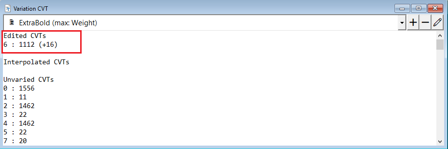

The Variation CVT Window allows for adding, editing, and deleting [cvar](https://docs.microsoft.com/en-us/typography/opentype/spec/cvar) variation data in a font for axis locations in variation space, and for setting the current location in variation space in the VTT UI. 

This window can be used to adjust the numeric value of particular control values for different variation instances. _(For example, editing the value of the x-height, control value, where the outline design in a particular instance is different from the default instance)_

**(3) VTT Talk Window _(ctrl + 5)_** High Level font hinting language.

**(4) Glyph Program Window _(TrueType code) _(ctrl + 2)_** TrueType assembly code

**Proofing**

Proofing hinting can be done by viewing the sample text string at the top of the main window, and using the visual size run at the bottom of the Main Window and Variation Window. The text string at the top is useful for giving a detailed look at the how the hinted glyphs will look at any given size. To change the viewing size, use the up and down arrows or click on a size in the size ramp at the bottom. The size ramp itself is crucial for proofing the hinted results all at once for a range of sizes, and can be used not just for the default instance but for all of the variations also. _(`ctrl + shift + up arrow / down arrow` is a quick and convenient way to toggle through the available variations in the font.)_

**Waterfall _(`ctrl + 8`)_**

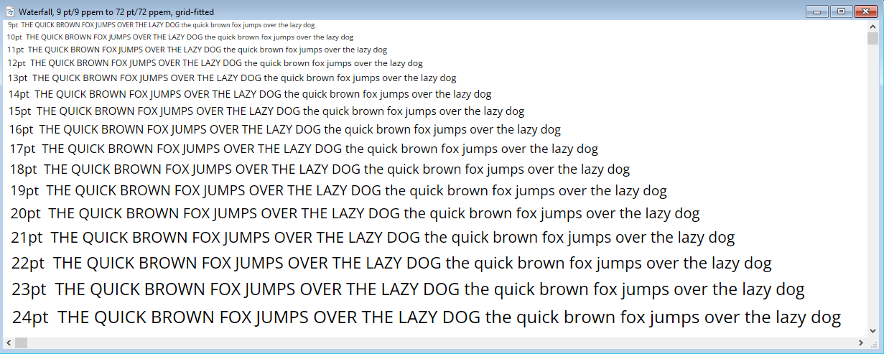

The waterfall window view allows for a quick preview waterfall of the glyphs that are already in the text sample string. _(To change the text sample `Tools > Options > Extra Text`. Glyphs added here will display in the text sample at the top, in the Main and Variation Windows, as well as in the Waterfall sample)._

**Character / glyph set _(`ctrl + 9`)_**

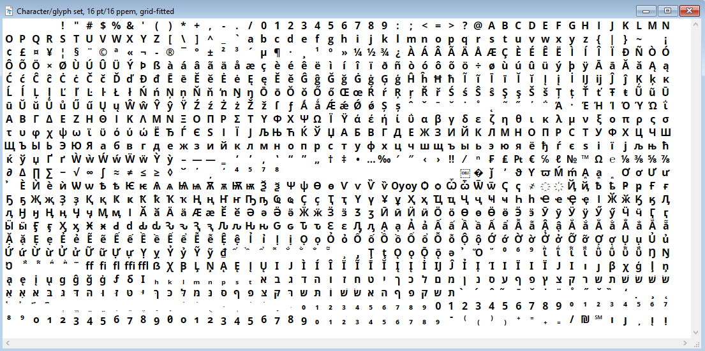

Proofing can be done on the entire glyph set, by choosing `View > Character / glyph set`. `ctrl + shift + up arrow / down arrow` can be used in both the Waterfall view and the Glyph set view to toggle between all of the available font variations. This is useful for proofing all of the Variation Instances in the font.

> **Pro Tip:** The Character/glyph set window (`ctrl + 9`) can be set to refresh with the Main View. Tools > Options > Settings > Refresh Char set with Main View. 

With this option set, use the Character/glyph set window, to proof the entire glyph set. Changing the resolution under Display> Resolution, will be refected in the Character/glyph set Window and is a good way to test and proof from lower to higher resolutions. With the Character/glyph set window, use ctrg g to quickly turn hinting on and off to spot any obvious distrotions between teh hinted and unhinted glyphs oultines. 

**Choosing Glyphs**

`Edit > Go to / glyph` **(`ctrl + H`)** Enter Glyph Index or Character code

or 

Using the Character set (`ctrl + 9`). Clicking on any glyph in the character set window, will take you to that glyph in the main window. 

**Notes on Keeping track of completed Hinting**

Keeping track of when the hinting is finished for each glyph is an important part of the workflow when hinting a variable font in VTT. _(The work to complete each glyph in the font will include editing the Autohinter output, hinting individual glyphs from scratch, and ensuring that composite glyphs are correctly positioned, as well as proofing each glyph across the variation space.)_

Hinting and proofing glyphs is rarely done in a sequential fashion. Rather, it is done in groups with similar characteristics - for example, uppercase glyphs, lowercase, figures, ligatures, etc. It is therefore important to find a scheme to keep track of when the hinting is final for each and every glyph, as VTT does not provide any ways to do this.

As an example, my own solution to this, is to use an old-school method. Set the character set (`ctrl + 9`) to order the glyphs by Glyph ID, which shows all glyphs in font. (`Tools > Options > Settings > Access Glyph by index`). Set the Character set to a comfortable size for printing or take a screen shot, and save this file as ‘Hinting Worksheet’. Use this file to markup every finalized, hinted glyph as you progress through the editing and proofing.

A color-coded system is shown here as an example of marking each glyph as having final hinted code,  edited, and proofed. In this example (Open Sans), there are four general categories for glyphs that need hinting and proofing.

1. **Unique glyphs** _(This can involve: Reviewing the Autohinter’s code, editing and fine tuning, or hinting from scratch.)_

2. **Pure composite glyphs** _(Composite of an original glyph with only offset commands in the glyph program. In this case, no code changes are necessary, only proofing. It is only the Unique reference glyph, which needs hinting)_

3. **Composites: Hinting code editing required.** Composite glyphs which use `USEMYMETRICS`, offset transformation and positioning code. At the time of writing, the code generated by the Autohinter does not work for variable fonts. The code calls a helper function (function 86) from the Font Program which uses an _outline measured distance_ as a reference for positioning accent glyphs in the y-direction. This procedure works for static fonts where there is only one measured distance, but in variable fonts, the distance between the accent and base glyph can vary. The code currently generated by the autohinter only positions the accent correctly for the default instance. 

If the measured outline distance between the base glyph and the accent is the same across the variation space, this code can be used. If the accent distance measurement varies, custom code is needed.

4. **Composites: Autohinter code output is correct**. If the the distance between the accent and base glyph is constant, across all variations in the font, the code output by the autohinter can be used to position accents.

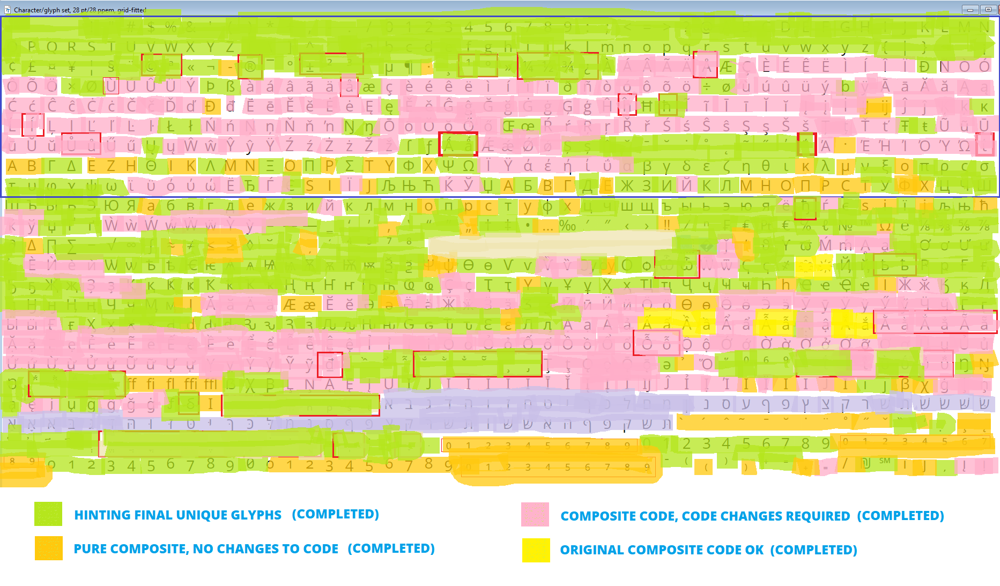

## Useful Keyboard Shortcuts

* `ctrl + g` : Grid-fit _(Hinting)_ on/off. 

* `ctrl + b` : Pixels on/off. It is useful to hint with pixels turned on to visualize the exact results of the hinting code. While hinting, it is also necessary to view the outline clearly to identify control point numbers. 

* `ctrl + =` : Go to point size

* `ctrl h` : Go to glyph, by glyph index or character code

* `ctrl + 9` : View Character set

* `ctrl + shift + up arrow / down arrow` : Runs through the Variation Instances in the Variations Window and Character / Glyph set Window, for proofing

* `ctrl + shift + y` : Show/hide Visual Hints in the Main and Variation Window

* `Left arrow / Right arrow` : Previous / Next Glyph

* `ctrl + r` : Compile  

* `ctrl + s` : Save 

## Font Outline Quality.

**General recommendations for outline quality**

Hinting is usually the last step in the production process. Any Variable font should be prepared and checked for any outstanding issues before beginning the auto-hinting process. Font outlines or metrics, cannot be edited for Variable fonts, in VTT, and any issues must be fixed in the original source fonts.

**Consistency**
- Vertical and Horizontal stems that are intended to be to be straight, should be exact. A few font units of difference, may require additional hinting to correct this.
- Outlines should include points on extrema. Glyphs with missing extrema points, particularly on curves at y-max and y-min points on the outline, cannot be hinted.
- Glyphs that are intended to have the same outline measurement, for heights for example, should be exactly equal
- Winding order should be correct. (Correct outline orientation, outer contours should run clockwise, inner contours counter-clockwise)

**Metrics**

No changes can be made to glyph metrics or advance widths in VTT. Spacing, and overall metrics, should be proofed and checked before beginning hinting. **Example:** _All glyphs that are intended to be monospaced, Such as Tabular figures, should all have the same advance width._

**Composite Glyphs**
- Flipped and scaled composites, that use the SOFFSET command, should not be used. These glyphs should be decomposed in the font sources and hinted as unique glyphs.
- Composites of composites should not be used.

## VTT Variable font workflow process 

**A Note on VTT importing Binary message:** VTT can import compiled, binary instructions from a font to the low-level language windows. When you open a font, VTT will ask you whether or not you want to import these instructions. When following the steps below to Run the Light Latin Autohinter, choose ‘No’ in step 4.

_You can also choose to disable this message permanently. By selecting the “Don’t show this message again” in the dialog box. **Note:** Selecting this option disables this prompt permanently. If you later want to import binary data, you must use the “Source from binary” command on the Tools menu._

**Step 1.** Autohinting a Variable Font

VTT includes an Autohinter for Latin fonts. The Autohinter makes use of a lightweight hinting strategy that focuses on fitting common heights, such as x-height, cap height, ascender, descender to heights stored in the Control Value Table (CVT). This strategy anchors these key heights to the grid, thereby maintaining consistency in heights across glyphs with common heights, as well as across a font family. This method of grid-fitting also helps to reduce blur and minimizes distortion.

**Follow these steps to Autohint a Latin font:**

1. Start Visual True Type
2. File > Open. Navigate to font file you would like to Autohint
3. Select Font File and Open
4. Choose **‘No’** when prompted to _‘Do you wish to import Font program, Pre-program, and Glyph Program source from associated binary data?’_
5. From the Tools menu, select Autohint > Light Latin Autohint.
6. Choose **‘Yes’** to the following message._‘Generate VTT Talk’... will now REPLACE all existing code. Do you really wish to generate VTT Talk?’_
7. When Autohinting is complete choose ‘Save’ from File Menu

**Note** _The Autohinter code works well for most glyphs. However, autohinting for all glyphs in the font should be carefully checked and proofed, and certain glyphs may need to be re-hinted manually, either by using the Visual Hinting tools, or by editing the VTT Talk code directly._

The Autohinter automatically generates VTTTalk (`ctrl + 5`) hinting information for each glyph, which in turn compiles down automatically to low-level TrueType instructions. (`ctrl + 2`)

VTTTalk is a high-level language designed to be easier for typographers to understand, rather than editing the more obtuse lower level true-type code. The main VTT Talk commands are used for the following types of hints

**Link** The distance between a pair of points is controlled by an entry in the CVT Table. Links always use a CVT reference. For example controlling the weight of a horizontal crossbar in the vertical direction.

**Dist** Controls the natural outline distance between a pair of points.

**Interpolate** Interpolates points between two parent points to find their correct position.

**Anchor** Points can be rounded to the nearest gridline, or to a grid-line specified by a CVT entry

These tables, in particular the VTTtalk table (`ctrl + 5`) for each glyph, is where most of the editing will be done. _Note: Composite glyphs do not contain any VTTtalk code, only low level TrueType code. Editing for composites, can only be done manually in each composite glyph program. (`ctrl + 2`) The Visual Hinting tools cannot be used for Composite glyphs._

When the Light Latin Autohinter is run, VTT also creates three global tables. 

**Control Value & cvar (cvt variations) tables)** (`ctrl + 4`)(`ctrl + shift + 4`) 

The CVT table is created automatically for Latin fonts, with pre-populated font measurements, saving you time, so that you can begin adding or editing the ‘Visual hinting’ in your font immediately, without the need to measure the font, and manually fill in the relevant CVT entries. The ‘cvar’ table currently requires manually editing.

The two other global tables that are created are the ‘Pre-Program’ and the ‘Font Program’. 

**Pre-Program** (`ctrl + 3`) In every font there are certain conditions that will always apply. In a TrueType font these conditions are controlled through code placed in the pre-program, for example at what size hinting will be turned on and off globally. _Note: There is minimal editing needed in the pre-program. Changing the size for when hints are enabled and or disabled globally, is the most common edit required._

**Font Program** (`ctrl + 7`) This table stores functions that can be called from the ‘Pre-Program’ or from the glyph’s instructions. Functions are used to eliminate repetitive code from being used in multiple glyphs. A common example is to control the placement of a diacritic over a base glyph. 

Typically there is no editing done in the font program. It is useful to have a look at the comments at the beginning of the most commonly used functions, to gain a better overall understanding of what each function does.

See this documentation for a more detailed description of the [‘Cvt’, ‘prep’ and ‘fpgm’](https://docs.microsoft.com/en-us/typography/truetype/hinting-tutorial/basic-global-tables)

VTT Also Generates a ['GASP](https://docs.microsoft.com/en-us/typography/opentype/spec/gasp) table for the font. 

## XML, Export and Import Hinting code

**Step 2.** Export, edit, import, and compile XML.

VTT allows for export and import of all hinting code to a separate XML file. This can be used in a few ways

**Archiving:** Saving a plain text representation of the hinting code in a font.

**Outline corrections:**  Hinting is usually the last step in the production process. If there are any problems with the outlines, outline modifications will be required. VTT does allow some point manipulation for static fonts, but not for Variable outlines. Changes to the original outlines must be made in the source files, in a font editor. The font can then be regenerated. 

**In summary:** Hints can be exported from a Variable TrueType font and saved to an XML file. Edits can be completed on the original source file outlines in a font editor, and a new TrueType file generated. The saved XML file, can then be imported into the new font and compiled and saved. From the VTT Menu _Tools > Compile > Everything for all glyphs > Save. Hinting can then be resumed._

**Important Note:** _This technique only works if the same glyph order and point order is preserved in the new generated font._

**Editing:** Export all hinting code from the font to XML, editing the XML in an external text editor, then re-importing those hints back to your original font, with modifications. 

In the following example, we will replace all ‘ResYDist’ code commands with the ‘YShift’ command. Using the YShift command in place of the ResYDist for controlling stem weights, helps to render the outlines of all Variations from Light to Black, using more natural rendering from the outline. The ResYDist command, causes stems to round to full pixels at smaller sizes. This causes distortions, particularly in lighter outlines. Using the YShift command in place of ResYDist corrects these distortions and renders the outlines more accurately.

**Export all hinting data**

1. From the File menu, choose Export, then “All code to XML”.
2. Choose a location to save the file.
3. Type a filename.
4. Click Save.

**Search and replace**

1. Open XML file in WordPad or any text editor that allow for search and replace
2. Replace: Find ResYdist > replace with YShift > replace all
3. Save.

**Import modified hinting code**

Note steps 1-3 below for exporting are not shown here, in the animation. The import takes about 30 seconds to complete for this font file.

1. Select the Import submenu of the File menu and choose “All code to XML”.
2. Select the XML file to import.
3. Click Open.
4. **From the VTT ‘Tools’ menu: Compile > Everything for all glyphs**
5. Save

All stems that previously used ResYDist to control the stem weight, will now use YShift. 

**Ensure to complete step 4 above, after editing and importing the XML file.**

## cvt - Control Value Table

The control value table (‘cvt’ Table), is a key part of the hinting process. As edits are done, or new hinting is added in the Main Window, ‘cvt’ values can be reviewed or assigned to key features such as heights or straight or round stems. 

When an outline is scaled to a particular size, hinting code is used to move points on the outline to align to the pixel grid. Because outline measurements can be slightly different across glyphs with similar features, the scaled grid-fitted results can be inconsistent. When the outlines are scaled, the slight differences in measurements, can cause inconsistent rounding. Heights and stems can become unequal. 
 
The ‘cvt’ table is a shared table of measurements and distances, that can be referenced by instructions in each glyph's, ‘glyph program’. Examples of the values for global font features that can be stored in the control value table are: Capital, Ascender, Descender, Figure, baseline, and x-heights, as well as distances for both x and y direction, stems and rounds.

**Note:** _When running the Autohinter in VTT, the ‘cvt’ table is created automatically for Latin fonts, with pre-populated font measurements, saving a lot of time. Editing the ‘Visual hinting’ in your font can begin straight away, without the need to measure the font, and manually fill in the relevant ‘cvt’ entries._

Referencing ‘cvt’ values from hinting instruction in a set of glyphs that share similar measurements, allows strict control over the regularity of these features. Distances such as stem widths, and key heights, can be controlled, so that they are the exact same pixel width and height at any given size, for lower resolutions.

For the hinting approach for Variable fonts described here, cvt’s are generally used to ensure heights are kept consistent at any given point size. When adding hints, an ‘anchor’ on any point, will be rounded to the nearest grid line. However, a YAnchor, _for example,_ can refer to a ‘cvt’ value to specify a height or overshoot shared by other glyphs in the font. Instead of rounding to the nearest grid line, the anchored point will round to the grid line specified by the ‘cvt’ value. 

This is also also useful for making global adjustments to heights, for a range of glyphs, by adjusting just one cvt. 
 
**Advantages of using the CVT table for Variable fonts**

- Consistency of features is maintained at lower resolutions
- Key Heights, can be kept consistent across glyphs with similar measurements
- Heights and proportions can be adjusted across a range of glyphs, with a global instruction.
- Subtle features such as undershoots and overshoots can be controlled by using Inheritance. Inheritance is a method, used in the cvt table, to force one cvt to be equal to another cvt until a certain size. This is used for smaller point sizes on-screen to supress subtle features that cannot be shown when there is a limited number of pixels
- Roman and Italic fonts cvt’s can be coordinated, to maintain consistent rendering across a family.
- New cvt’s can be added to the ‘cvt’ table for glyph ranges that fall outside the defined cvts, such as ‘small caps’, for example
 
 
 **Global Adjustments**

Once a ‘cvt’ has been assigned to a group of glyphs it is then also possible to make a global adjustment to that ‘cvt’, in the ‘cvt’ table, with one line of code.
 
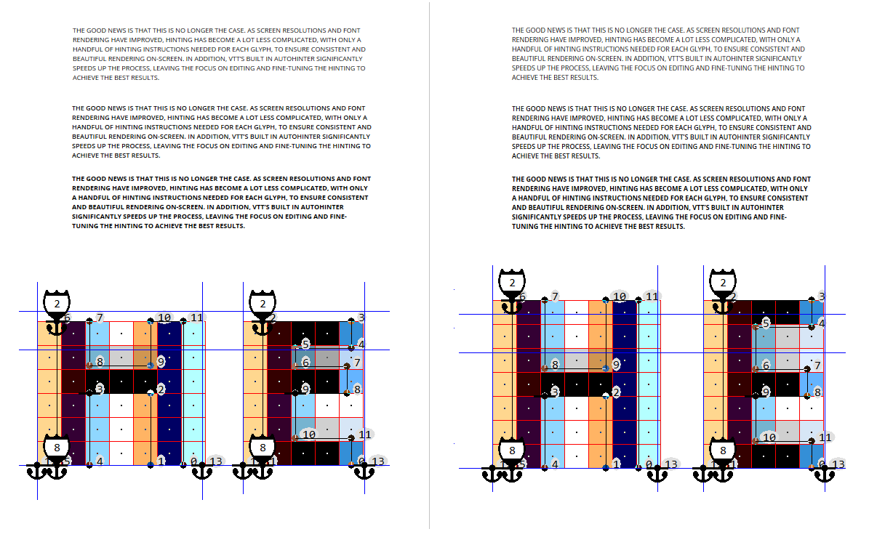

**Open Sans Variable font**

**Left:** Hinted glyphs using Cap Height ‘cvt’ 2 at 9pt@72dpi / 7pt@96dpi

**Right:** Hinted glyphs using Cap Height ‘cvt’ 2, with Global Delta added to raise Cap Height by one pixel at 9pt@72dpi / 7pt@96dpi
 
In this example the Cap height ‘cvt’ 2, stores a measurement of 1462 font units, which is the measured outline distance of the square Cap Height. At 9 point at 72dpi / 7 point at 96dpi, this value is scaled, and rounds to the nearest pixel grid, which results in a Cap Height of 6 pixels.
 
To change this height globally, a ‘Delta’ command is used to raise the Cap Height for all glyphs that reference the ‘cvt’ for either square or round Cap height. 

This Delta command raises the Cap Height by one pixel for all of the instances in the font. For smaller screen sizes this method can be used to change the proportion of the key heights in font as well as to improve how Bolder weights display on-screen. Adding a ‘Delta’ command, can be used for any ‘cvt’ that requires adjustment.

**Note:** When adjusting one height, other heights should also be reviewed, and adjusted if necessary, to ensure the correct proportion is maintained, between heights.
 
**Globally adjust height in the ‘cvt’ table:**

Open the CVT Table (`ctrl + 4`) and refer to the ‘cvt’ for Cap Height, ‘cvt’ number 2. Directly after the ‘cvt’ type the following, Delta(1@9) and compile, ctrl ( r ) and save.
 
**CVT Entry for Square Cap Height**
2:  1462 /* cap height */
 
Delta(1@9) /* Raise Cap Height globally by 1 pixel */
 
 
**Note:** In Variable fonts a Delta command can only be used, if the cvt does not vary across the Variation Space. For example, a Bolder weight variation may have a larger measured outline height. This height is edited in the ‘cvar’ _(cvt variation table)_ to reflect this difference. Because of the difference in height, the bolder weight cvt, can round differently and the ‘Delta’ to change the height for the Bold may not be required.

## Hinting Concepts (Hinting the Capitals)

**Hinting the Control Glyphs H & O**

Let’s look at how to add hinting to the capital ‘H’, and ‘O’ using the graphical hinting tools, and take a closer look at the high-level hinting code _‘VTT Talk’_ and the lower level _‘Glyph Program’,_ TrueType code. The hinting code that is needed for these _control characters_, contains a lot of information that will translate to the rest of the glyph set.

In some cases the automatically generated code is not optimal, or is incorrect. In these cases it is often easier and faster to re-hint a glyph from scratch, rather than edit the autohinter code.

Understanding how to use the basic graphical hinting tools, and the hinting code, makes it easier to view the visual hinting, to quickly determine if the code is correct, or if further editing or re-hinting is necessary.

Once you become familiar with some hinting concepts, tools, and code, editing the hinting or re-hinting, can be completed quickly. The automatically generated code, for the most part, will be either fully correct, or will only need some small edits.

**Hinting strategy for hinting the uppercase H**

1. Control the top (Capital Height) and bottom (Baseline) to be consistent with other uppercase glyphs, using values in the Control Value Table as a reference. Minimise blur at the Cap Height.
 
2. Control the position of the middle horizontal bar, in relation to the baseline and Capital height. Minimise blur on the horizonal Bar.

3. Control the weight of the middle horizontal bar.
 
**Tip:** _Before beginning, ensure Auto Compile is turned on. (Tools > Options > Settings Auto-compile Main view). This will speed up the hinting, by allowing VTT to automatically generate the hinting code as you work with the Graphical Hinting tools, without the need to compile after each step in the process._

**Hinting the Cap H**

**Step 1: Baseline and Cap Height Control** 

Choose the YLink Tool from the Toolbar. Position the ‘blue circle’, directly over point 5, and right click. With the right mouse button held down, drag to the right to select ‘round to grid’ then release.

The following code is generated in the VTT Talk Window.

**VTT Talk**

**YAnchor (5, 8)** Moves point 5 to the control value listed in the ‘Control Program’, that corresponds to the baseline, (cvt #8) and rounds this point to a grid line. (View > Control Program:  (8: 0 /* base line */)

**YShift(5,1)** Choose the YShift Tool. Position the ‘blue circle’, directly over point 5, and drag to point 1. Shifts point 1, to a new position on the grid, relative to point 5’s new position on the grid, ensuring point 1 will also be grid-fit to the baseline.
 
**Note:** Because the capital ‘H’ is defined as ‘Uppercase’, VTT knows which group of values to use from the Control Value table, and will generate the correct values automatically.

**Cap Height Control**

Repeat Step 1, this time for point 6 at the Cap Height.

**YAnchor (6, 2)** Moves point 6 to the control value, that corresponds to the cap height, (cvt #2) and rounds this point to a grid line. (View > Control Program:  (2: 1462 /* cap height */)

**YShift(6,10)** Shifts point 10, to a new position on the grid, relative to point 6’s new position on the grid, ensuring point 10 will also be grid-fit to the cap height.

**Note:** _There are different methods that can be used in hinting. The best methods are efficient, using the least amount of code. An alternate method to using the shift command, is to YAnchor points 1 and 10, using cvt 8 and 2. The hinted result will be the same._ 

**Middle Bar Control**

Now that the Baseline and Cap Height have been established and reference the correct control values, the middle bar now needs to be interpolated to find its correct position. 

When the outline is scaled and the cap height is rounded to the grid, the outline can round up or down, depending on the size. The middle bar now needs instruction on where to find its correct position, between the baseline and the cap height.

**Step 2: YInterpolate** 

Choose the YInterpolate tool. Position the _‘blue circle’_, directly over point 5 and drag to point 6. You will see a line appear, which takes the form of a draggable _‘elastic band’._ No code is generated yet until a point is chosen to interpolate. Click anywhere on the line, and drag the curser to the point you want to interpolate, in this case point 3, and release. The following code is generated in the VTT Talk Window.

**YInterpolate(5,3,6)**

The middle bar is now positioned correctly, between the base line and cap height but one more step is needed. To maintain as much contrast as possible and to reduce blur, one side of the middle bar needs to be aligned to the pixel grid.

**Step 3: Round to grid** 

Right click on point 3, drag to the right to ‘round to grid’, and release. The YInterpolate code, will be replaced with the following code

**YIPAnchor(5,3,6)**

Moves point 3, to full pixel grid, positioned relative to point 5 and point 6, which now has a new grid-fit position. This ensures high contrast on the bottom of the horizontal crossbar on the Cap H, and helps to minimise blur. _(The Autohinter also chooses point 3 on the bottom of the horizontal bar, to interpolate, between the top and bottom of the Cap H.)_

If point 8 was chosen, the bar would have a tendency to round down and may cause the bar to look optically low. It is better visually for the bar to be high as opposed to low, the same concept as is used in the high resolution design. This same hinting strategy can then be used in a consistent way, for other glyphs with a centre bar, capital ‘E’, ‘F’, etc.

**Step 4: Control the middle horizontal bar weight**

Choose the YShift tool. Position the blue circle over point 3, and drag to point 8. The following code is generated in the VTT Talk Window.

**YShift(3,8)** Shifts point 8, to a new position, relative to point 3’s new position on the grid, maintaining the same relative distance between the point 3 and point 8 as is in the original high resolution design of the outline. The shift command does not reference a cvt value and does not move the hinted point 8 to a full pixel grid line. Shift also does not default to a one pixel minimum used by the Link command. Using the Shift command will maintain a balanced visual weight, of horizontal features in particular, across all variations.

**Step 5: Adding the Res command** 

The Res addition to the command ResAnchor, for example, stands for Rendering Environment Specific, and ensures that the appropriate rounding happens, for the various rendering environments. This saves adding additional Hinting commands if Hinting is required to work in a variety of rendering environments._The Res command calls a Function, that is designed to also allow for more subtle rendering of features such as undershoots and overshoots_

Switch to the VTTtalk window** (`ctlr 5`). Type Res before the YAnchor commands. Compile VTT Talk, (`ctrl r`) and save (`ctrl + s`).

The ‘Res’ _(Resolution Environment Specific)_ command is not supported when using the Graphical Hinting tools. This additional code can be added manually, in the VTTtalk window. 

The final code in the VTTtalk window will appear like this. The Res command is highlighted here for easy comparison. 

/* Y direction */

**Res**YAnchor(5,8)

YShift(5,1)

**Res**YAnchor(6,2)

YShift(6,10)

YIPAnchor(6,3,5)

YShift(3,8)

Smooth()

_The hinting for Cap H is now complete. The glyph can be proofed in the main window, using the text string to see shape and spacing, in the size ramp to see the hinted results at a range of sizes, and in the Variation Window, to proof for all variations in the font._

Now let’s take a closer look at the lower level _‘Glyph Program’,_ TrueType code. VTTtalk compiles into TrueType instructions, which can be viewed and edited if necessary in the Glyph program. (`ctlr 2`) _Editing TrueType instructions is not commonly done, however it is useful to have an understanding of what the code is doing._

Refer to the full [TrueType Instruction](https://docs.microsoft.com/en-us/typography/opentype/spec/tt_instructions) set for details.

**NOTE:** RES Commands (Rendering Environment Specific)
_VTT supports a new set of commands, in the high-level font hinting language (“VTT Talk”). These commands replace and extend the functionality of existing commands. The new commands are added automatically by the VTT Autohinter, when Autohinting a font, and can also be added by manually editing the hinting code in the VTT Talk window and compiling. Res commands cannot be added via the graphical user interface._

_RES commands, (Rendering Environment Specific) can be used to constrain a glyph for a variety of rendering environments. The new commands map to TrueType functions, which determine the rounding granularity dynamically. To view the original TrueType code, the Res instructions can be removed and the VTTtalk compiled._ 

The following is each VTTTalk instruction followed by the corresponding TrueType Instruction, for the Capital H. _This is shown here for instructional and learning purposes. The RES commands generated by the Autohinter by default should be left in place._

**SVTCA[ Y ]** **S**et **V**ector **T**o **C**oordinate **A**xis Y. Sets the hinting direction to the Vertical or Y direction, the direction in which points will be shifted or moved. The Vector refers to the Freedom Vector, the direction in which points are moved. 

**YAnchor(5,8) > MIAP[ R ], 5, 8** **M**ove **I**ndirect **A**bsolute **P**oint. Moves point 5 to the value of CVT 8 and rounds point to grid. Indirect refers to the use of a CVT value, as opposed to using the actual coordinate distance to round to grid. The TrueType code for the direct method of rounding a point would be MDAP[ R ], 3 where the point is rounded to the nearest gridline, without a reference to CVT value. 

**YSHIFT(5,1) > SHP[ 1 ], 1** (Shift point by the last point) Moves point 1 maintaining the same relative distance between point 5 and point 1. 

**YAnchor(6,2) > MIAP[ R ], 6, 2** **M**ove **I**ndirect **A**bsolute **P**oint. Moves point 6 to the value of CVT 2 and rounds point to grid. 

**YSHIFT(6,11) > SHP[ 1 ], 1** (Shift point by the last point) Moves point 11 maintaining the same relative distance between point 6 and point 11. Note, if the point that is shifted, has the same measurement in the y-direction, the point will also be rounded to grid. Is the point to be shifted, does not have the same measurement in the y-direction, the same relative distance will be maintained as in the original outline, but will not be rounded to grid. 

SRP2[], 5 **S**et **R**eference **P**oint 2

**YIPAnchor(6,3,5) > IP[ 3 ]** Moves point 3 so that the relationship to point 5 and point 6, is the same as was in the un-hinted high resolution outline. **> MDAP[ R ], 3** **M**ove **D**irect **A**bsolute **P**oint 3 Rounds point 3 to the Grid

**YSHIFT(3,8) > SHP[ 1 ], 8** (Shift point by the last point) Moves point 8 maintaining the same relative distance as in the original outline, between point 3 and point 8.

**Smooth() > IUP[ Y ] IUP[ X ]** At the end of the VTTtalk for each glyph there is a Smooth[] command. This command is then compiled into a IUP[ X ] and IUP[ Y ] TrueType instructions. These instructions move the points that have not been hinted with the points that have been hinted, smoothing out the hinted outline. 

**Hinting the Cap O**

**Hinting strategy for hinting the uppercase O**

Control the top _(Cap round overshoot height)_ and bottom _(Cap round undershoot height)_ to be consistent with other uppercase glyphs, using values in the Control Value Table as a reference.
 
Reduce blur at the Capital Overshoot height, and baseline undershoot height, using *Inheritance, to force the undershoot and overshoot values to be equal to the baseline and square cap height until a defined size

_*Inheritance: A method of forcing one cvt to be equal to another cvt until a certain size. This is used for smaller point sizes on-screen to supress subtle features that cannot be shown when there is a limited number of pixels_
 
Control the weight of the top and bottom rounds of the O

**Step 1: Control bottom of Cap O** 

Choose the YShift Tool from the Toolbar. Position the ‘blue circle’, directly over point 5, and drag to point 22. Two lines of code are generated in the VTT Talk Window.

**YAnchor(5,9)** Moves point 5 to the control value listed in the ‘Control Program’, that corresponds to the baseline cap round undershoot value. 

**Note on Inheritence:** Inheritance is a method, used in the cvt table, to force one cvt to be equal to another cvt until a defined size. Inheritance is used in this case for smaller point sizes on-screen to supress subtle feature of undershoots and overshoots, that cannot be shown when there is a limited number of pixels.

Here CVT 9, _(defined in the cvt table as the cap round undershoot)_is automatically forced to be equal to the baseline cvt 8, which has a value of zero, until a higher size. CVT 3, _(defined in the cvt table as the cap round overshoot)_ is automatically forced to be equal to square cap height cvt 2, until a higher size. This supresses the undershoots and overshoots, until there are enough pixels to show this subtle feature. This will already be automatically generated in the cvt table, and you will only need to change the value for appropriate point size to show the overshoots and undershoots. 
 
The baseline cap round undershoot value in the cvt table looks like this.
 
**9: -22 ~ 8 @ 47 /* base line undershoot */**
 
9 is the cvt number for the cap baseline undershoot
 
-22 ~ means the relative outline measurement from baseline of 0 to bottom of the Cap 0, a measurement of -22 units.
 
8 designates the parent cvt, which is the square baseline in this case. 
 
47 means that the overshoot should kick in at 47 ppem. Replace the 47ppem by whichever ppem size you wish the overshoot to kick in.

**YShift(5,22)**

Shifts point 22, to a new position, relative to point 5’s new position on the grid, maintaining the same relative distance between the point 5 and point 22 as is in the original high-resolution design of the outline.

**Step 2: Control top of Cap O** 

Choose the YShift Tool from the Toolbar. Position the ‘blue circle’, directly over point 14, and drag to point 29. Two lines of code are generated in the VTT Talk Window.

**YAnchor(14,29)** Moves point 14 to the control value listed in the ‘Control Program’, that corresponds to the cap height overshoot.
 
3: 22 ~ 2 @ 47 /* cap height overshoot */
 
3 is the cvt number for the cap height overshoot. **Note:** 22 is an average value calculated by the autohinter. _(The actual measured difference between the square cap outline measurement of 1462, and the round cap overshoot measurement, of 1485 is 23, and the bottom round undershoot is 20. It is however better to have both of these values to be equal, to ensure the same rendering behaviour for both overshoot and undershoot at all sizes)_
 
22 ~ means the relative outline measurement from square cap height of 1462 to the top of the Cap O, an averaged value of 22 units.
 
2 designates the parent cvt, (cap height) which is the square cap height.
 
47 means that the overshoot should kick in at 47 ppem. Replace the 47ppem by whichever ppem size you wish the overshoot to kick in. The size at which the undershoot and overshoots will kick in, is usually kept to be equal.
 
**YShift(14,29)**
Shifts point 29, to a new position, relative to point 14’s new position on the grid, maintaining the same relative distance between the point 14 and point 29 as in the original high-resolution design of the outline.

**Step 3: Adding the Res command**

Switch to the VTTtalk window** (`ctlr 5`). Type Res before the YAnchor commands. Compile VTT Talk, (`ctrl r`) and save (`ctrl + s`).

The final code in the VTTtalk window will appear like this. The Res command is highlighted here for easy comparison.   /* Y direction */

**Res**YAnchor(5,9)

YShift(5,22)

**Res**YAnchor(14,3)

YShift(14,29)

Smooth()

_The hinting for Cap O is now complete. The glyph can be proofed in the main window, using the text string to see shape and spacing, in the size ramp to see the hinted results at a range of sizes, and in the Variation Window, to proof for all variations in the font._

## Hinting Concepts (RES Instructions)

VTT supports a set of instructions in the high-level font hinting language (“VTT Talk”). The RES instructions are added automatically when Autohinting a font.
 
‘RES’ _(Rendering Environment Specific)_ instructions, are an extension to the hints in VTT Talk, enabling different types of rounding to happen automatically for a variety of rendering environments. While VTT Talk’s existing hints, compile to TrueType instructions, the ‘Res instructions’ use a set of TrueType functions. These functions determine the appropriate rounding for each rendering environment, such as GDI or DirectWrite. Using Res instructions is the recommended approach for Variable font hinting.
 
**Note:** _Adding the ‘Res’ instructions is not supported when using the Graphical hinting tools in the Main Window. ‘Res’ needs to be appended to the existing Hinting commands. This can be done by editing in the VTT talk window and compiling. The Light Latin Autohinter, adds the ‘Res’ instructions automatically. You can then continue to edit the hints in the font, via the GUI, and VTT will preserve the ‘Res’ hint commands._

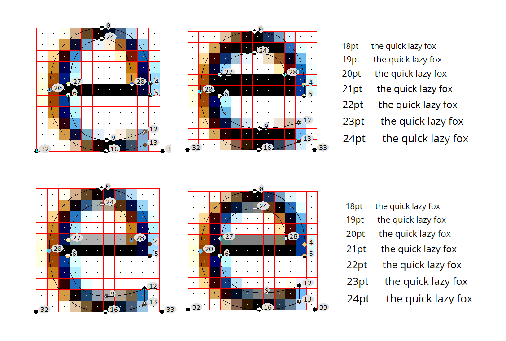
 
**(TOP)** In the example above, the y-rounds and the middle bar of the lowercase ‘e’ are hinted using a ‘YDist’ instruction. In GDI and DirectWrite _(shown here),_ the rounds and middle bar will round to a full pixel or pixels. The ‘YDist’ instruction always rounds to a full pixel. **Note:** _(The y-rounds and middle bar of the of the ‘e’, in this case, break from one to two pixels, from 20 to 21 point. This makes the rendering too light at 20 point and too heavy at 21 point. The transition from 20 to 21 point is also abrupt, a change of one whole pixel, and can look like a weight change has happened.)_
 
**(BOTTOM)** The rounds and middle horizontal stem use a ‘ResYDist’ instruction. These features now round to a fractional pixel, allowing for the weight to be described correctly, and for a much smoother transition, when there is a size change.
 
Using this method of allowing stems to round to fractional pixels, renders the outlines of a Variable font from the lightest weights to the heaviest using a more subtle rounding, remaining faithful to the original outline weights. 

Rounding to fractional pixels also allows for subtle features such as undershoots and overshoots to appear less dramatic on-screen and look more natural. When undershoots and overshoots for the font kick in on-screen, instead of using one full pixel above the Cap or x-height, and below the baseline, which can appear too dramatic and cause heights to look misaligned, fractional pixel rounding can show this subtle feature, without distorting the outlines.
 
The following are the ‘Res’, Y-Direction hinting instructions added automatically by the VTT Light Latin Autohinter.
 
- RESYAnchor: Used in combination with a cvt reference to control heights.
- RESYDist: Used to control the weights of rounds and stems.
 
If cvt’s are used in hinting to control stems 

- ResYlink instruction, can be used in combination with a cvt reference.
 
A consistent use of the ‘Res’ instruction is important. For example if a height is anchored using a ‘ResYAnchor’ and a cvt in one glyph, and a ‘YAnchor’ and the same cvt in for a similar height in another glyph, there may be different rounding on-screen at some sizes.
 
**Note:** In the method for hinting Variable fonts described here the ‘ResYDist’ instructions are replaced by the ‘YShift’ instruction. The ‘YShift’ instruction behaves very much like the ‘ResYDist’ instruction, rounding stems and rounds, to a fractional pixel. YShift will not round to a full pixel for any stem, allowing for a more natural rendering of the outlines, in particular for very light weight Variations at smaller sizes.

If full pixel rounding is required, either ‘ResYDist’ or ‘ResYLink in combination with a cvt, should be used to control the weight of stems and rounds.
 

## Editing the Capitals Hinting

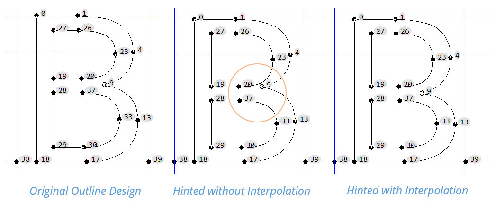

**Capital B Interpolation**

**Left:** Original outline design of the Capital ‘B’ in Open Sans

**Middle:** Hinted outline without interpolation

**Right:** Hinted outline with interpolation
 
**Editing the Cap B**

As you gain more experience in looking at the code and the graphical representation of the hints, you will start to see patterns of glyphs and features that need attention.

In the Capital B, the two points 8 and 9, designed correctly in the y-direction in the original outline design, between the middle bar, become offset in the hinted version, when no interpolation is used.

The middle bar has been controlled by hinting, but points 8 and 9, now need further instruction as to how to find their correct position. As you can see in the animation this only takes a few seconds to complete.
 
Choose the YInterpolate tool. Position the ‘blue circle’, directly over point 28, at the bottom left of the middle bar, and drag to point 19. You will see a ‘line’ appear, which takes the form of a draggable ‘elastic band’. No code is generated yet until a point is chosen to interpolate. Click anywhere on the interpolation line, and drag to the point you want to interpolate, in this case point 8 and release.

**Note:** Sometimes two points fall very closely together on the outline, so you may need to zoom in see more clearly and to ensure you pick the correct points to interpolate.

The following code is generated in the VTTtalk Window.
 
YInterpolate(19,8,28)
 
Now while zoomed in, click again anywhere on the interpolate line, drag to point 9 and release. Point 9 is now added to the interpolate code

YInterpolate(19,8,9,28)
 
That’s it for the edits on the Cap B, and the hinting is complete and ready for proofing. The points 8 and 9 now use the middle bar as a reference as to where to correctly position, for all sizes. **Note:** Interpolations by default do not round points to a grid line. In most cases this is the desired result.

While viewing the autohinted results, any kind of distortion, as described here in the B, most likely means that some additional editing and or code addition or deletion is needed. The goal for this style of hinting is always to ensure there are no obvious distortions happening the hinted outline. The closer the hinted outline is to the original design, the better the rendering will be on screen. 

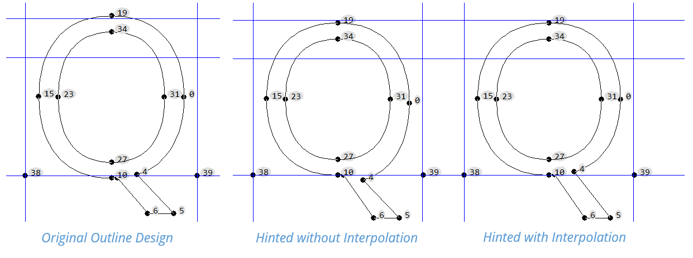

**Capital Q Interpolation**

**Left:** Original outline design of the Capital ‘Q’ in Open Sans

**Middle:** Hinted outline without interpolation

**Right:** Hinted outline with interpolation
 
**Editing the Cap Q**

Similar to the Capital B, the two points 4 and 7, are positioned correctly in the y-direction in the original outline design, between the bottom round of the Q, but become badly offset in the hinted version, when no interpolation is used.

The bottom round has been controlled by hinting, but points 4 and 7, now need further instruction as to how to find their correct position in the hinted outline.
 
Using the same technique as in the B, drag the interpolation tool from the bottom of the lower round on the Q, from point 10 to point 27. Click anywhere on the interpolation line, and drag to the point you want to interpolate, point 4, and release.

_**Note:** In this case point 4 is the most obvious point to interpolate, but on closer inspection, point 7 also needs fine control and should be included in the interpolation._

The following code is generated in the VTTtalk Window.
 
YInterpolate(27,4,7,10)
 
That’s it for the edits on the Cap Q. The hinting is complete and ready for proofing.

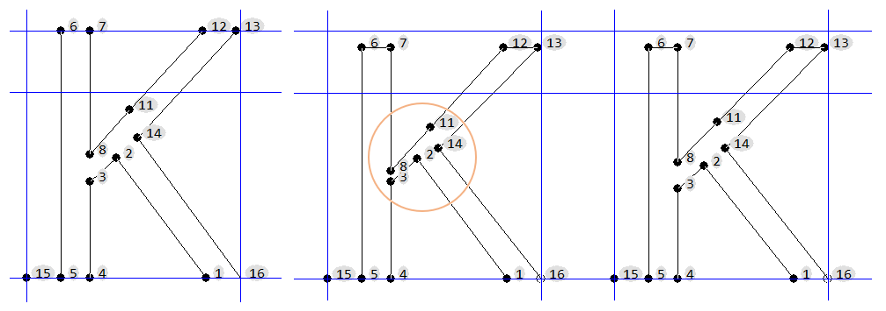

**Capital K Interpolation**

**Left:** Original outline design of the Capital ‘K’ in Open Sans

**Middle:** Hinted outline without interpolation / middle section of the K becomes distorted and appears light

**Right:** Hinted outline with interpolation, corrects the hinted position of points 3, 8, 2 and 14
 
**Editing the Cap K**

Editing is shown here for the default regular Weight and the light variation. The middle part of the K becomes distorted and may cause the outline to look light on-screen. It is best to proof glyphs in the main window at a low hinted size, shown here at 9 point, where it is easier to spot the distortions. 

Using the same technique as in the B, drag the interpolation tool from the baseline of the Cap K, from point 5 to point 6 at the cap height. Zoom in for easier editing. Click anywhere on the interpolation line, and drag to the point you want to interpolate, point 3, and release. Click on the interpolation line again, and repeat for points 8, 2, and 14. 

That’s it for the edits on the Cap K. The middle points are now correctly positioned in the hinted outlines for all variations. The hinting is complete and ready for proofing. 

Editing glyphs and adding interpolations can be done in an efficient way using the graphical hinting tools. As you progress through the glyph set and gain more experience, its becomes easier and faster to spot where and for which glyphs any additional edits are needed. Proof glyphs by turning hinting on and off, `ctrl + g` at some smaller point sizes to spot distortions.

**Editing other Capitals**

Once you become more familiar with viewing the Autohinter output, editing the hinting using the graphical hinting tools, can be done quickly. The animation above, combines the editing for the ‘A’‘M’‘R’‘N’‘S’‘V’‘W’. All of the edits are interpolations. Quickly add the interpolations and proof the glyphs in the main window and variation window.

## Hinting Concepts (Hinting the Lowercase)

**Hinting the Control Glyphs n & o**

Now, let’s look at how to add hinting to the lowercase ‘n’, and ‘o’ using the graphical hinting tools. For this example, the hinting has been deleted and the glyphs are hinted from scratch. In a typical workflow when hinting a Variable font, these glyphs will likely only need minor edits to the Autohinter output.

**Hinting strategy for hinting the lowercase ‘o’**

Control the top _(lowercase round overshoot height)_ and bottom _(lowercase round undershoot height)_ to be consistent with other lowercase glyphs, using values in the Control Value Table as a reference.
 
Reduce blur at the lowercase overshoot height, and baseline undershoot height, using inheritance, to force the undershoot and overshoot values to be equal to the baseline and square x-height until a defined higher point size.

**High level hinting strategy for hinting the lowercase ‘n’**

1. Control the top left stem (square x-height) and top round (lowercase round overshoot) and bottom (Baseline) to be consistent with other lowercase glyphs, using values in the Control Value Table as a reference. Minimise blur at the square and round x-height.

2. Control the weight of the top round. 

Using the same techniques and approach as described for the Capitals above, add the Hinting using the graphical interface hinting tools. As the glyphs are recognised as lowercase by VTT the correct cvt’s for lowercase baseline, x-height and lowercase overshoot and undershoot will be generated automatically as you add the hinting. 

**Hinting the ‘o’**

The hinting approach for the lowercase ‘o’, is identical to the Capital O. Control the bottom and top rounds, and use a shift to control the weight of the top and bottom rounds. The same concept of inheritance is used for the overshoots and undershoots, the only difference is the cvt’s that are referenced in the Control Value Table, relate to the lowercase glyphs. 

This same hinting approach is used for all lowercase glyphs, with similar rounds, ‘b,c,d,e,p,q,s’, as well as the rounds of ‘f,g,h,j,m,n,r,t,u’. When all of the lowercase glyphs reference the same cvt values for these key heights, consistent alignment for baseline, x-height, ascender, descender, and overshoot and undershoot behaviour, is guaranteed onscreen for all point sizes.

**Hinting the ‘n’**

While hinting the lowercase n, there are a some additional points, that need to be controlled in addition to the baseline, square and round x-height. These points, 18 and 19 need instruction as to where to find their correct position in the hinted outline. Note here, that because of the nature of Variable font design, these points are positioned differently across the variable design space. In the default weight, the y-coordinates of the points fall on the outline in the y-direction between the baseline and the bottom the top round, while in the Condensed Bold weight, the y-coordinates of these same points are higher in the outline and fall in the y-direction between the top round. 

The best solution to ensure these points find their correct position across the Variable design space, is to use a shift command, from point 9 to point 18. Points 18 and 19 are at the same y-coordinates, so only one point needs to be touched. _These points cannot be interpolated between the top round of the ‘n’, as they are positioned differently in different weights of the font. The y-coordinates of interpolated points must fall between the two parent points, referenced in the Interpolation._

**Edit the Hinting for the lowercase ‘i’**

The lowercase ‘i’ is a great example of why it is important to have a hinting strategy in mind, before adding the hints. In the high resolution design, the dot on the ‘i’, is a separate part, with white space always maintained between it and the main part of the glyph. This is a key feature that must also be maintained when the glyph is hinted and rendered on-screen, particularly at small sizes. 

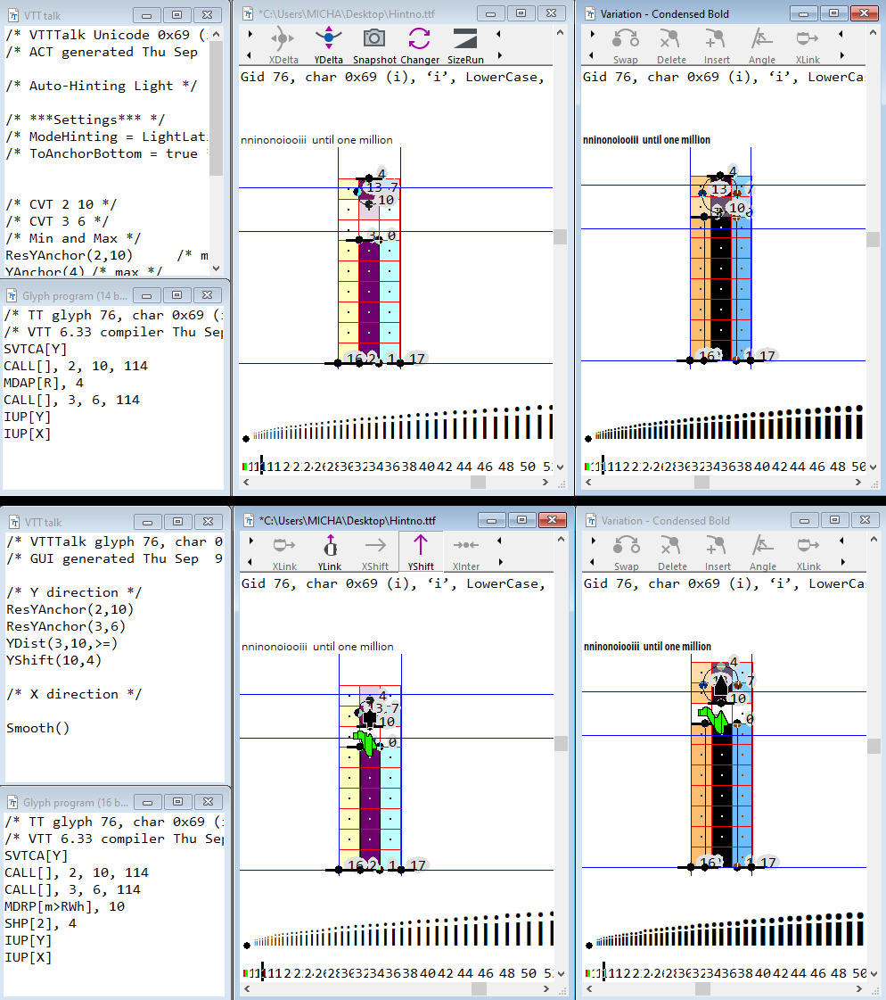

**Top:** In the top example here, when hinting is applied by the Autohinter, there is no stragety in place to keep this critical white space open and clear. The autohinter finds the top of the dot on the ‘i’ as a y-extreme, moves this point to the grid, and then misses controlling the weight of the dot. When the top of the dot on the ‘i’, is rounded to the grid, this rounding happens independently from the hinting on the main stem of the ‘i’. This can cause the dot in some cases, as shown here in the condensed Bold, to round down to the grid, and clash with the ‘i’ stem, causing the glyph to look more like a lowercase ‘l’, than an ‘i’. 

**Bottom:** Showing the hinted glyph, kept open and clear. Note the Bold condensed Version in the Variation Window.

With a hinting strategy in mind, to always keep this white space open, it is easy to use some simple code to maintain a clear, open and readable glyph at all sizes for all variations. 

**Edit the Hinting of the ‘i’ to keep dot clear**

This example shows how powerful VTT is, in allowing for some simple edits and code, to solve this screen rendering problem, for all variation of the glyph. 

To edit the autohinter output for the lowercase ‘i’ dot. Right click on point 4 at the top of the dot and drag to the left to remove the YAnchor command. **Note** _When any edits are made with the graphical hinting tools, the comments that are added by the Autohinter in the VTTtalk are removed, making it easier to view, and edit this code._

Once this edit is made the remaining code for the main stem of the ‘i’, remains, and is perfectly hinted, with the baseline point 2, anchored to the lowercase baseline cvt:10, and the top, point 3 anchored to the x-height cvt:6

The only code that is now needed is the critical code to maintain the white space between the base stem and the dot of the ‘i’. Choose the YLink tool, drag from point 3 to point 10 at the bottom of the ‘i’ dot, and make sure that the minimum distance is chosen. The following code is generated in the VTTtalk window.

**YDist(3,10 >=)**

The ‘>=’ in this command, ensures that there is always a minimum distance of 1 pixel maintained between point 6 at the lowercase square x-height to the bottom of the dot on the ‘i’. The bottom of the dot is now also rounded to the grid, maintaining contrast. Now choose the shift tool, and drag from point 10 to point 4 to control the weight of the dot. 

That is the hinting completed for the lowercase ‘i’. The dot will be kept at the correct distance from the main stem of the ‘i’, and critically, the white space will be maintained for all weights and variations of the glyph. Simple and powerful! This same strategy can be used to keep similar glyphs with similar features open and readable at all sizes. 

## Editing other lowercase glyphs

Once the control glyphs have been reviewed, and edited, hinting can progress on rest of the lowercase glyphs. As each glyphs is reviewed to ensure the correct cvt’s are assigned and the hinting structure overall, as output by the autohinter is correct, small edits can then be done to each glyph to fine tune the results. 

Note in the animation, only smaller edits are made, to shift untouched points and to add some interpolations. In some glyphs the autohinter adds hints, that are not needed, such as in the lowercase ‘r’. The shift from point 6 to point 3, is not needed, and can be removed, by a click and drag on the arrowhead of the shift to point 3. 

## Hinting complex glyphs

**Hinting strategy for Yen**

1. Control the top (Capital Height) and bottom (Baseline) to be consistent with other figure glyphs, using values in the Control Value Table as a reference. Minimise blur at the Cap Height.
 
2. Control the position of the two middle horizontal bars, in relation to the baseline and Capital height. 

3. Control the weight of the middle horizonal bars.

4. Maintain white space between middle bars in all variations.

The Autohinter is able to do 1 2 and 3, but has no strategy for 4. Maintaining white space is critical to ensure the glyph is kept open and readable. It is often easier and faster to re-hint more complex glyphs from scratch, with a clear strategy in mind, rather than edit the autohinter code.

**Step 1: Baseline and Cap Height Control** 

Choose the YShift Tool from the Toolbar. Position the ‘blue circle’, directly over point 12, and right click. With the right mouse button held down, drag to the right to select ‘round to grid’ then release. The Yen is defined in the  ‘Figure’ category, and the baseline cvt for the figure category will be chosen automatically. 

**YAnchor (12, 12)** Moves point 12 to the control value listed in the ‘Control Program’, that corresponds to the Figure baseline, (cvt #12) and rounds this point to a grid line.

**YShift(21,4)** Using the YShift Tool position the ‘blue circle’, directly over point 21, and drag to point 1. Moves point 21 to the control value listed in the ‘Control Program’, that corresponds to the Figure square height, (cvt #4) and rounds this point to a grid line. 

**YShift(21,1)**
Shifts point 1, to a new position on the grid, relative to point 21’s new position on the grid, ensuring point 1 will also be grid-fit to the figure height.

**Step 2: Position middle bars** 

**YIPAnchor(12,17,21)** Choose the YInterpolate tool. Position the ‘blue circle’, directly over point 21, at the top left, and drag to point 12 at the baseline. Click anywhere on the interpolation line, and drag to the point you want to interpolate, in this case point 17 and release. Right click on point 17 and drag to the right to round the point to grid. It is important to choose the bottom point of the top middle bar, to begin the positioning, as this will be used to ensure the white space is preserved between the middle bars. This will also place point 17 on a full pixel boundary ensuring that one side of the bar is kept on a high contrast grid boundary.

**YShift(17,6)** YShift from point 17 to point 6, to ensure point 6 is aligned with point 17

**YShift(17,20)** YShift from point 17 to point 20, to control the weight of the top middle bar.

**YShift(20,3)** YShift from point 20 to point 3, to ensure point 3 is aligned with point 20

**YShift(3,0)** YShift from point 3 to point 0, to position point 0 correctly in relation to the middle bar.

**Step 3: Maintain White Space** 

This is the critical step in the hinting process, to ensure that there is always white space maintained between the two middle bars, and to keep at least one side of the lower bar on a high contrast grid boundary. 

**YDist(17,16,>=)** Choose the YLink Tool from the Toolbar. Position the ‘blue circle’, directly over point 17, and drag to point 16 and release. Right click on the green arrowhead and drag down to ensure the minimum distance option is chosen. 

**>=** The greater than and equals sign appears after the 16 in the YDist command. This means, always keep a minimum distance of at least one pixel, ensuring in this case that there will always now be at least one pixel of white space between the two middle horizonal bars. This ensures that the glyph will appear open and readable at all sizes for all variations. This same strategy can be used for similar complex glyphs, in the currency range, or for other glyphs with multiple horizontals. 

**Note** _The YLink tool can generate two type of commands, a YLink, that uses a cvt as a reference to control a distance or YDist that uses the outline measurement, and no cvt._

**YShift(16,7)** YShift from point 16 to point 7, to ensure point 7 is aligned with point 16

**YShift(16,13)** YShift from point 16 to point 13, to control the weight of the bottom middle bar.

**YShift(13,10)** YShift from point 13 to point 10, to ensure point 10 is aligned with point 13

The hinting for the Yen is now complete. The heights are set, middle bars correctly positioned, and white space maintained for all sizes and all variations. 

## Hinting Accent glyphs

**Hinting strategy for Acute**

1. Move the bottom of the glyph to align to the grid
 
2. Ensure hinted glyph is at least two pixels in height at all sizes for all variations.

The Autohinter has no special strategy for hinting accented glyphs. By locking the top and bottom of the accent to the grid, the autohinter code can cause accents to collapse to one pixel in height. A one pixel high Acute accent, may be mistaken for a dot accent.

To ensure the best readable solution, accents that need it, should be hinted to be a minimum of two pixels in height for all sizes. 

**Hinting the Acute (0xb4)**

Choose the YLink Tool from the Toolbar. Position the ‘blue circle’, directly over point 6, and drag to point 12. Two lines of code are generated in the VTT Talk Window. Right click on the green arrowhead below point 12, and drag down to ensure the minimum distance option is chosen. _If you have set the YLink tool previously to use a dist and minimum distance, this may be already set._

YAnchor(6,16)
YDist(6,12,>=)

VTT automatically generates a cvt, when anchoring point 6. This cvt is not required, as accents are positioned later over the base glyphs using different positioning code. To remove the cvt, right click on the anchor symbol below point 6, drag to left to release. This sets point 6 to round to grid, but not use a cvt. The code will update to the following.

YAnchor(6)
YDist(6,12,>=)

Choose the YInterpolate tool, drag from point 6 to 12. Click anywhere on the interpolation line, and drag to point 1. Click again and drag to point 8.

YInterpolate(12,1,6,8)

The graphical hinting is now done. To ensure that the accent is at least two pixels tall at all sizes, move to the VTTalk Window. (`ctrl + 5`) 

Add 2 after the >= and compile the VTTTalk. (`ctrl + r`). This instructs the hinting to maintain a minimum distance of 2 pixels.

YDist(6,12,>=2)

The final code will look like this.

YAnchor(6)

YDist(6,12,>=2)

YInterpolate(12,1,6,8)

Smooth()

The acute accent now has the correct hinting, and ready for proofing. The accent will appear to be at least two pixels tall at all sizes, making it readable and clear for all variations.

**Hinting strategy for Tilde**

1. Move the bottom of the glyph to align to the grid
 
2. Ensure hinted glyph is at least two pixels in height at all sizes for all variations.

3. Preserve the correct shape of the glyph
 

**Hinting the Tilde (0x2dc)**

Choose the YLink Tool from the Toolbar. Position the ‘blue circle’, directly over point 17, and drag to point 5. As in the previous example, ensure the YDist is set to use a minimum distance. This can be checked by clicking on the arrowhead or viewing the generated code in the VTTTalk window. If minimum distance is set a >= will appear after the YDIST command.

YAnchor(17,16)

YDist(17,5,>=)

Choose the YShift Tool from the Toolbar. Drag from point 5 to point 13, and from point 17 to 25, to align points 13 and 25 relative to points, 5 and 17. 

YShift(5,13)

YShift(17,25)

Right click on the anchor symbol below point 17 to remove the height cvt that was auto generated by VTT. 

YAnchor(17)

Choose the YInterpolate tool, drag from point 17 to 5. Click anywhere on the interpolation line, and drag to point 22. Click again and drag to point 10. _Note: There are different ways to hint any glyph. Another strategy for the Tilde would be to control the weight of the glyph, by using a shift command from point 17 to point 10, and from point 5 to 22. This will also work. This will depend on the design of the glyph and what type of variations are in the font. For Open Sans, the interpolation technique, works well to control the weight from light to black._

YInterpolate(5,10,22,17)

_Optional hinting step: Right click on point 5, and drag from Round to Grid, four spaces to the right to choose round up to grid. This command instructs the outline to round up to grid, and can produce better results in the heavier variations. By rounding up to grid, the glyph height can increase overall. More pixel can help in describing the shape of the tilde in the heavier weight variations._

YUpToGrid(5)

The graphical hinting is now complete. To ensure that the accent is at least two pixels tall at all sizes, move to the VTTalk Window. (`ctrl + 5`) 

Add 2 after the >= in the YDist(17,5,>=) command and compile the VTTTalk. (`ctrl + r`). This instructs the hinting to maintain a minimum distance of 2 pixels.

The final code for the Tilde in the VTTTalk window will look like this.

YAnchor(17)

YShift(17,25)

YUpToGrid(5)

YDist(17,5,>=2)

YShift(5,13)

YInterpolate(5,10,22,17)

Smooth()

## Composites 

**Composite Glyphs**

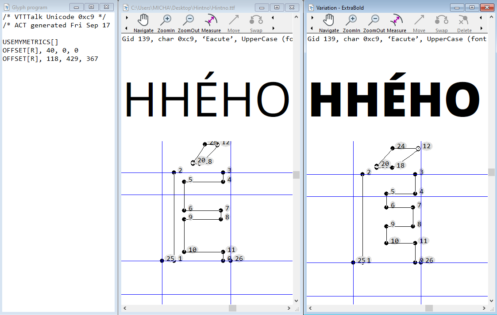

Composite glyphs are composed from one or more other glyphs, saving font file space. A common example of use is for accented glyphs, e.g. ‘Eacute’. The Capital E and the Acute are hinted as unique glyphs, and are then composed as a Composite, forcing the rendering to be identical to the base glyphs referenced. 
 
VTT’s Autohinter generates the code for composites glyphs containing a reference, _(in VTT the Glyph ID number)_ to the original glyphs as well as additional positioning or offset code. 

Let’s take a look at the glyf program code for the ‘Eacute’ as output by the VTT Autohinter. **Note:** The Visual hinting tools cannot be used to generate code for composite glyphs and any additional editing that is needed, is done in the TrueType (‘glyf’ program) instructions (`ctrl + 2`). A composite glyph may contain further hinting instructions, for example, to position the accent correctly for smaller sizes at lower resolutions. See section on Positioning Accents.

**Capital E acute, Unicode 0xc9, Glyph ID 139**

USEMYMETRICS[]

OFFSET[R], 40, 0, 0

OFFSET[R], 118, 429, 367

**USEMYMETRICS[]** Instructs the composite to use the same metrics or advance width, from the glyph referenced in the first OFFSET instruction. 

**OFFSET[ R ], 40, 0, 0** The first value 40, is the glyph index for the first component, the Capital E. The next value (zero) is the X offset amount in units per em. The final value (zero) is the Y offset. The offset code the base glyph, is the first line of code. Offset amounts, are usually set to zero for both X and Y.

**OFFSET[ R ], 118, 429, 367** Positions the diacritic. The first value, (118) is the Glyph ID for the Acute accent. The second value (429), the X offset, positions the diacritic in the x-direction. The next value (367) positions the diacritic in the y-direction and is usually the same for all Y distances in all composite glyphs. 

The values for positioning the diacritics are for high resolution. **Note:** Additional code is required to position accents for smaller point sizes to ensure the accent does not clash with the base glyph. 

**Other examples or composite glyphs**  

In the Open Sans font, the Capital Greek Alpha has the same exact design and metrics as the Capital A (GID 36). The composite code is
 
**Unicode 0x391 Ellipsis (Glyph ID 350)**

USEMYMETRICS[] (Use the Capital A metrics)

OFFSET[ R] , 36, 0, 0 (Use Capital A, with zero offsets for x and y)
 
Once the Capital A has been hinted and proofed for all Variations, the composite glyph for the Greek Alpha only needs to be proofed quickly, with no addition hinting code required
 
**Offset only composites**
 
**Unicode 0x2026 Ellipsis (Glyph ID 527)**  
 
OFFSET[R], 17, 0, 0

OFFSET[R], 17, 529, 0

OFFSET[R], 17, 1055, 0
 
If the advance width and or spacing is different, USEMYMETRICS[] is not used and offsets only, are used. The ‘ellipsis’ (Glyph ID 527) is a composite glyph, using the ‘period’ as a reference glyph. In this case the period is referenced three times, with only offset code to correctly position components. Once the ‘period’ glyph has been hinted and proofed for all Variations, the composite glyph for the Ellipsis only needs to be proofed quickly, with no addition hinting code required.

## Positioning accents
 
VTT Autohinter generates additional code for composite glyphs, to position accents for smaller font sizes and lower resolutions. The code used in the VTT Version 6.35 can cause problems in Variable fonts. All accented glyphs need to be carefully checked to make sure the automatic code is correct. The following are some of the problems, and solutions.
 
**Accent Positioning code**
 
In addition to the Offset code, VTT Light Latin autohinter generates code to position accents in the x and y-direction.
 
**X-direction positioning Code**
 
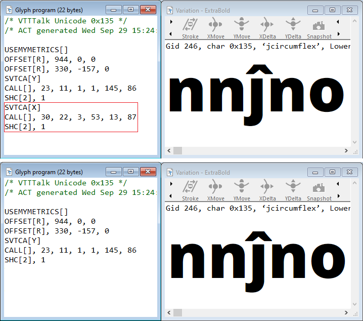

**Top:** Function 87, used to position accents, causes the circumflex accent, to be uncentered.

**Bottom:** X-direction code removed. and glyph program compiled and saved. Accent is now centered and positioned correctly, using x-offset code only, for all Variation instances.

The x-direction code for composite glyphs, generated by the autohinter, should be removed for all accented glyphs. Function 87, used to position accents, can cause badly positioned accents in some Variation instances in Variable fonts. 

The x-offset code is sufficient to position accents correctly for all Variation Instances in the x-direction. By removing the x-direction code, accents will be positioned correctly. This will also reduce the overall font file size.
 
**Removing x-direction code:** ‘jcircumflex’ 0x135 (GID 246) in OpenSans Variable
 
With the Glyph program window selected, (`ctrl + 2`), delete the following code. 

SVTCA[X]

CALL[], 30, 22, 3, 53, 13, 87

SHC[2], 1

Compile the glyph program, (Tools > Compile > Glyph program, or(`ctrl + r`) and Save. _Repeat for all accented glyphs in the font, that contain x-direction or SVTCA[X] code._
 
**Y-direction positioning Code**
 
1. If the measured high resolution outline distance, in the y-direction, between the base glyph and the accent glyph is constant, for all of the Variations in the font, the code generated by the autohinter, for y-positioning, calling Function 86 can be used. This will position the accent correctly for both lower and higher resolutions.
 
2. If the measured high resolution outline distance, in the y-direction, between the base glyph and the accent glyph, changes across the variation design space, the code generated for y-positioning, calling Function 86, **cannot be used.**

**Problem**

The code generated by the autohinter for ‘edotaccent’ 0x117 (GID 217) in the Open Sans Variable font, causes the accent to appear too high at higher resolution in the Extra Bold Variation.
 
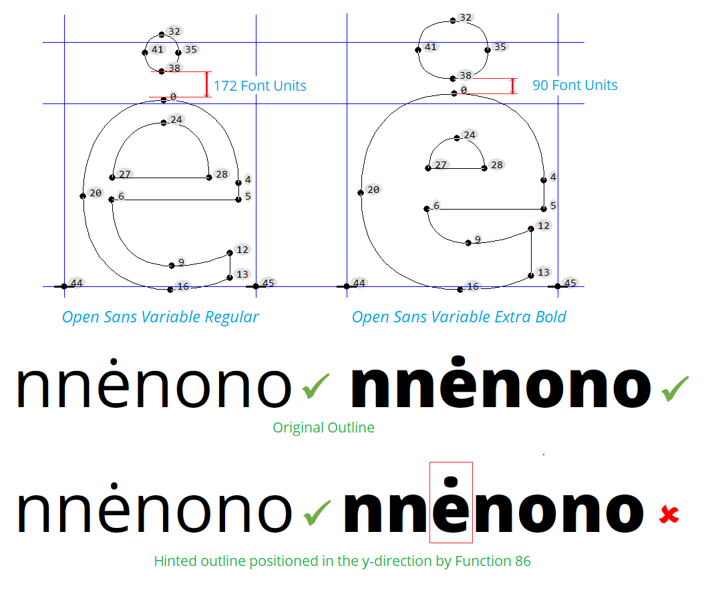

‘edotaccent’ 0x117 (GID 217) Open Sans Variable font.

**Example of incorrect positioning, in detail**

VTT Autohinter adds code to maintain a minimum distance of at least one pixel between the base glyph and the accent. This code is used to ensure that at smaller sizes there is no clashing of an accent with the base glyph. The details of this are important to look at to make sure that the font overall is fully functional for both higher and lower resolutions.
 
The method VTT uses to position the accents in the y-direction, calls a function from the Font Program (Function 86). The function is designed to position accents and also maintain white space between the base glyph and the accent. Depending on the design of the outlines this function can cause problems.
 
Let’s look at the y-direction code, for ‘edotaccent’ 0x117 (GID 217)
 
SVTCA[Y] /*sets the Vector to the Y axis*/

CALL[], 38, 0, 1, 1, 172, 86

SHC[2], 2 /*shifts contour 2*/

**Code explanation**

CALL[], 38, 0, 1, 1, 172, 86, calls Function 86
 
**38:** Point on the accent, in this case the lowest extrema point on the dot

**0:** Point on the base glyph, the extrema point at the top of the ‘e’

**1:** Rounding method /* Round to grid*/

**1:** Minimum distance

**172:** Measured high resolution outline distance in Font Units, between the base glyph, point 0, and point 38 at the bottom of the dot accent.

**86:** Function Number

In the Regular Default weight, the measured distance of 172 Font units, from top of base glyph to bottom of accent is correct. 

**Note:** _The Function uses a measured outline distance of 172, from base glyph to the accent. This is correct for static fonts, as there is only one measurement, but incorrect when used in a variable font, where the distance from base glyph to accent can vary significantly._

In the Extrabold Variant the dot over the ‘e’ is designed to be much closer to the base glyph and the measured outline distance, is 90 Font Units. This design is correct for high resolution, where the accent in the Regular weight is higher, keeping the typographic colour open. In the Extrabold design, the dot accent is designed to be closer to the base glyph to maintain the right typographic colour.
 
**Solution** 

With the Glyph program window selected, (`ctrl + 2`), delete the following y-direction code. The x-direction code should also be deleted. Compile the glyph program and save. 

SVTCA[Y]

CALL[], 38, 0, 1, 1, 172, 86

SHC[2], 2

The code for the ‘edotaccent’ composite now only has OFFSET[]'s to position the dot accent correctly for higher resolutions.

USEMYMETRICS[]

OFFSET[ R ], 72, 0, 0

OFFSET[ R ], 72, 0, 0

After the second OFFSET command, type the following code to ensure the following.
 
- Position the accent correctly for both higher and lower resolutions
- Maintain white space between the base glyph and the accent, keeping the glyph open and readable at all sizes and for all of the variations in the font.

SVTCA[Y]

CALL[], 0, 7, 114

MDRP[m>RWh], 38
 
IUP[Y]

IUP[X]

Compile the glyph program and save.

**Y-Positioning code details** 

**Note:** _Comments before each line describes the code._
 
Sets Vector to coordinate axis Y

**SVTCA[ Y ]**
 
This code emulates a ResYAnchor and a minimum distance.

0, is a point at the lowercase round overshoot height on the base
composite glyph. Point 0, at the top round of the lowercase ‘e’.

7 is a reference to cvt 7, the lowercase round overshoot height cvt.

114 is the Function that is generated by the Res command
to ensure the correct rounding is applied for different
rendering environments
 
**CALL[], 0, 7, 114**
 
38 is the on-curve point on the bottom of the dot accent. This code moves the accent to be at least one pixel from the base glyph for all sizes, variations, and rendering environments, while also maintaining the correct outline distance for all variations.

**MDRP[ m>RWh ], 38**
 
Smooths out the rest of the outline points.
 
**IUP[ Y ]**

**IUP[ X ]**
 
Use this code technique for all other composite glyphs, changing the point and cvt references.

**Note:** _All composites where the measured high resolution outline distance, in the y-direction, between the base glyph and the accent glyph, changes across the variation design space, should use this code technique to position accent correctly._

## Roman and Italic coordination

When there is an Italic Variable font as a companion to the Roman, it is recommended to coordinate key values and table settings between the two. When the Roman font hinting is complete, the values that are set in the Roman font can be used, _if appropriate,_ in the Italic font.

**CVT and CVAR Height values**

If the Italic companion Variable font has similar or exact design measurements for the key heights in the font, (Cap, x-height, Ascender, Descender, Figure, etc) these values should be set to be the same in the ‘cvt table’ and the ‘cvar’ table, for both the Roman and Italic Variable font. 

When the fonts are used together in a document, a shared set of values, will ensure there is a consistent and exact alignment between Roman and Italic for all sizes on-screen.

**Overshoot and Undershoot behaviour**

Size at which the Undershoots for Caps, lowercase and Figures, are allowed to kick in on-screen. This is controlled in the CVT Table. These values can be coordinated between the Roman and Italic Variable font to ensure consistent rendering behaviour.

**Global control to turn Hinting on and off**

Turn off instructions globally in the font, below 9ppem and above 2047ppem. 

VTT’s Autohinter generates a value of 8ppem in the pre-program for the size at, below which, to globally turn hinting off and 2047ppem for the size at, above which, to turn hinting off. These values can be changed to suit whatever is the lowest and highest size at which hinting is required. 

It is generally recommended not to use hinting below 9ppem. At sizes that are even smaller, there are not enough pixels for hinting to be beneficial, and rendering the outline with DirectWrite anti-aliasing and no grid-fit or hinting, is recommended.
 
The code to globally control this, is listed at the beginning of the Pre-program. Open the Pre-program in VTT (`ctrl + 3`) to view or edit these values. After any edits, compile the pre-program and save. The same values can be used for both the Roman and Italic Variable fonts.
 
/* Instructions On/Off */
 
#PUSHOFF

MPPEM[]

#PUSH, 2047 /*Greater than 2047 hinting is turned off globally*/

GT[]

MPPEM[]

#PUSH, 8 /*Less than 8ppem hinting is turned off globally*/
 
**Global Deltas**

Global deltas applied to Height cvts, in the Roman font should be repeated in the Italic.

**Gasp Table**

Values in the GASP table, describe the combination of sizes at which hinting and anti-aliasing should be applied. These values are generally shared between the Roman and Italic Variable font styles. The default values that are generated by the Autohinter are recommended.

## Final Production Steps

When all glyphs have final hinting, editing, fine-tuning and proofing, there are a few final steps to take, before saving the font to ship.

**1. Compile everything for all glyphs**

VTT allow you to Compile all of the necessary tables with one command. From the main menu, choose, 

Tools > Compile > Everything for all glyphs.

This compiles all of the tables in the font, including Control Program, Font program, Pre-program, VTT Talk, and the Glyph instructions, which Visual TrueType creates from the VTT Talk source code. _The font should compile cleanly in VTT. If there are any stray edits, for example in the VTTtalk or Glyph program window of any glyph, that were unintended, VTT will report an error and point you to the glyph that contains the stray character or unintended edit._

**Note:** Compiling all tables, does not save this change. After compiling, choose File > Save. 

**2. Re-calc maxp-table**

The final version of your font should require only as much memory as necessary. Before you save your font for the last time, Visual TrueType can recalculate values for the ‘maxp’ table to update the memory actually required by each glyph. Be sure to recalculate the ‘maxp’ table before you prepare the font for shipping, which strips out private tables needed for this calculation.

**To reduce the memory required by the font**

- On the Tools menu, click Recalc ‘Maxp’ Table.

_Refer to the built in Help File in VTT, for more information on Compiling and memory requirements_

**3. Saving and Shipping**

**Save VTT Source font**

When working on a font in VTT, this font file contains all the source data for the hinting that has been completed. The shipping version of the font should not contain all the VTT related private tables. This file should be safely stored and saved in a seperate location. Additional hinting to the font may be required at a later date or the glyph set may need extending.

**Prepare a “ship” version of font for distribution**

This version of the font is the final shiping font and will have been stripped of the private tables. Visual TrueType removes the Visual TrueType source code and the TrueType source code (or glyph program) assembled from that Visual TrueType source code, but not the binary TrueType ‘glyf’ table created from the TrueType source code.

- On the Tools menu, click Ship Font.

- Specify where you want to save the new file.

- In the “File name” field, type a new file name.

- Click Ship.

_Refer to the built in Help File in VTT, for more information on saving the font file and preparing to Ship your font._

## VTT Variable Font Hinting Checklist

A quick checklist for completing the hinting in a Variable font in VTT.

- Outlines proofed / ready for Hinting / Any outline issues addressed and fixed in source files
- Run Light Latin Autohinter
- Check in VTT for font Errors (Menu > View > Font errors and warnings)
- Set min and max size for hinting instructions _(pre-program)_
- Export XML > edit > Import XML > (Tools > Compile > Everything for all glyphs > Save)
- Review, Edit, re-hint if necessary, and proof for all Variation Instances, all autohinted glyphs. (e.g. Add interpolations, edit code to remove unnecessary hints, check for correct cvt assignments) 
- Accents hinted to a minimum of 2 pixels in height. _(If required)_
- All Composite glyphs checked for correct y-positioning, and proofed for all Variation Instances
- cvt edits _(Control Value Table)_
- cvar edits _(cvt Variations Table)_
- GASP table edits _(Grid fitting and Scan-conversion table)_
- Compile everything for all glyphs _(Tools > Compile > Everything for all glyphs > Save)_
- No Font errors or warnings
- Recalculate MAXP Table
- Save
- Ship
