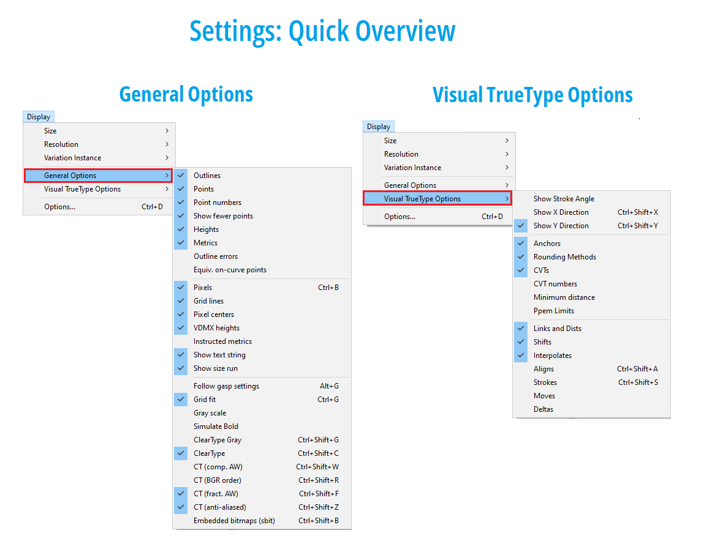

# how-to-vtt
A how-to guide to TrueType hinting variable fonts, with Visual TrueType

_by Michael Duggan_

_“The glyphs look like crisp pixel sculptures with lots of detail!”_ — Erik van Blokland

Feedback from client on a VTT Hinted Variable font

### Introduction
Font Hinting has always been thought of as a ‘Black Art’, some magic performed behind the scenes, hard to understand, and very difficult to do. This was true, when [hinting was done for low resolution screens,](https://docs.microsoft.com/en-us/typography/truetype/fixing-rasterization-issues) and older font rendering techniques, _(e.g. black and white or monochrome rendering)_. Older font rendering techniques required a lot of hinting code, ensuring every feature in the font was strictly controlled, to ensure consistent and clear on screen display. This made Hinting an _extremely_ time consuming, and skilled task, for specialists only. In addition hinting was often a manual process, involving writing and editing TrueType code by hand.

The good news is, this is no longer the case. As screen resolutions and font rendering have improved, hinting has become a lot less complicated, with only a handful of hinting instructions needed to ensure consistent and beautiful rendering on screen. In addition, VTT’s built in Autohinter, significantly speeds up the process, leaving the focus on editing and fine tuning the hinting, to achieve the best results.

**VTT (Visual TrueType)** 

[VTT](https://aka.ms/vtt-mst) has been upgraded to handle all aspects of hinting for Variable fonts. The following tutorial will go into detail on all of the steps you will need, to use VTT, to automatically add, and then fine tune the hinting for Variable fonts.

### Background / Older Font Hinting

In Digital fonts each character or glyph is described by a set of outlines. For older methods of font rendering, when the outline was scaled to a small size and rendered onto a coarse grid of pixels, each pixel whose centre lay within the outline, was set to black. This method never produced good results. The resulting bitmaps shapes were irregular and usually misshapen, glyph stems became uneven, spacing was not controlled, and individual glyph shapes were poor.

To help solve these problems, some form of font intelligence, or instructions, or [Hinting](https://docs.microsoft.com/en-us/typography/truetype/hinting) was needed. These Truetype instructions, helped to translate a typeface’s high resolution outlines, to the coarse pixel grid of a screen. To ensure even and easy to read text, every feature had be controlled, including spacing, symmetry, stem consistency, individual glyph shape, proportion, and overall typographic colour. Special instructions called ‘Deltas’, were often used to even further refine a glyphs shape, to turn individual pixels on or off, at a specific point size on screen. 

Achieving perfect results, however, required expert hinting knowledge, a huge amount of code, and months of painstaking detailed work. 

**Left** _(Older autohinting code)_ Hinting intended for black and white rendering. Code is added to control every aspect of the glyph for onsceeen rendering. X-direction code was required to control, spacing, proportion, symmetry, diagonal control, alignment and glyph shape. Additional Deltas would be needed to clean up the appearance of the glyph for perfectly symmetical display in black and white.

**Right** _(New style hinting)_  Greatly reduced Hinting instruction set, controlling x-height alignment and interpolation. The ‘x’ Hinting code that was required in the horizonal direction, is no longer needed and instead the rendering is done from the font outline, by DirectWrite subpixel rendering.

### Newer rendering / Why Hinting is still important

Most modern Browsers and common rendering environments, such as Microsoft Office on Windows, now have full support for the latest DirectWrite rendering. VTT also has the DirectWrite font rasterizer built in. This allows for proofing the hinting of a Variable font, in the VTT Tool, without having to install the font to test the hinting results. While working in VTT, you can maintain a high level of confidence that the hinted results will be replicated in the real world, in browsers and applications that use DirectWrite as their default. 

**Key Features of [DirectWrite font rendering](https://docs.microsoft.com/en-us/windows/win32/direct2d/direct2d-and-directwrite#glyph-rendering)**
 
**Subpixel Positioning**
 
When DirectWrite renders a fonts spacing, glyphs can now begin on a subpixel boundary. [Subpixel positioning](https://docs.microsoft.com/en-us/windows/win32/directwrite/introducing-directwrite#improved-text-rendering-with-cleartype), greatly improves the spacing of type on screen, especially at small sizes. The spacing accuracy that can be achieved by starting a glyphs spacing on a subpixel boundary, versus a whole pixel as in GDI, is significant. This more accurate spacing is critical in achieving a smooth flow and even typographic color to the text. In addition, hinting is no longer needed to control the fonts spacing, which in the past required a lot of extra code and time to complete.
 
**Horizontal and Vertical antialiasing**
 
Subpixel rendering improves the horizontal aspect of type on screen but not the vertical. Older types of Rendering, such as Cleartype in Windows GDI for example, only supported horizontal anti-aliasing. This meant that aliasing or ‘jaggies’, were still very apparent at larger sizes on screen. In order to fix this problem and give a smoother vertical effect, DirectWrite applies [anti-aliasing in the y-direction](https://docs.microsoft.com/en-us/windows/win32/directwrite/introducing-directwrite#improved-text-rendering-with-cleartype), in addition to using the horizontal subpixel rendering. 
 
The addition of support for vertical anti-aliasing, helped a great deal in smoothing out the appearance of text onscreen, particularly at larger sizes. 

However, for smaller font sizes, when a fonts outlines are scaled and rendered with no hinting, the vertical anti-aliasing can result in significant blur, particularly for horizontal features. By aligning key heights and horizonal features to the pixel grid, Hinting helps to greatly reduce this blur, in particular for text reading sizes, on lower resolutions screens.

**Hinting Benifits for todays common rendering environments**
 
**Alignment of key Heights**

Main Heights, such as Capital, x-height, Figure,Ascender, Descender, are controlled and kept consistent on-screen for all sizes, across all variations, and styles of a Variable font

**Sharp rendering of Horizontals strokes and alignment zones**

A simple set of Hinting instructions, fits horizontal features of the font outline to the pixel grid, which significantly reduces blur. 
 
**Maintaining correct distances**

This allows all glyphs to be render clearly on-screen across all variations. 

Accented glyphs are hinted once, to be a minimum of two pixels in height, if needed, and at least one pixel clear of the base glyph, for all variations. This ensures readable text across all variations, allowing for open and clear rendering on screen, for detailed aspects of the font design, down to the smallest text sizes.  

Glyphs with complex outline structure can be made to render clearly on screen.

**Examples: Benifits of Hinting / Open Sans Variable / DirectWrite rendering**

**Alignment and blur reduction**

**Top:** Scaled un-hinted outlines, at 13ppem/10 point @96dpi, results in blurry horizontal features. _(Open Sans Variable font, default, Regular weight, ‘E’, ‘T’, ‘H’)_

**Bottom:** Hinted outlines. Reduces blur, by fitting horizontals to the pixel grid. _(Shown with VTT Visual Hinting)_

**Top:** Scaled un-hinted outlines results in Blurry horizontal features. _(Open Sans Variable font, default, Regular weight, ‘e’, ‘o’, ‘t’)_

**Bottom:** Hinted outlines, reduces blur, by fitting horizontals to the pixel grid.

**Maintaining Distances**

**Top:** Accented glyphs, at 13ppem/10 point @96dpi. Accents lose details and blur together with the base glyphs, resulting in loss of legibilty. _(Open Sans Variable font, default, Regular weight, and ExtraBold Variation.)_

**Bottom:** Hinted accent. Accents are hinted to preserve the correct shape, and to maintain a consistent height. A minimum distance is maintained between the base glyph and the accent for all variations.

**Top:** Scaled un-hinted outlines of complex glyph outlines, results in blurry horizontal features.

**Bottom:** Hinted outlines, reduces blur, by fitting horizontals to the pixel grid, while also preserving the internal white space, allowing for clear display on-screen.

### VTT Design Space Setup _(Hinting and Proofing Variation Fonts)_

Hinting, editing, and proofing a Variable font in VTT is detailed work. It is helpful to have the workspace in VTT set up to a consistent and comfortable view. Becoming familiar with the tools, info, settings, & options, will help you get the most out of VTT, and streamline the hinting process. 

_On opening a Variation Font, you can arrange the Windows in VTT to suit your own workflow. Make any edit, and save (ctrl s). This will save the VTT preferences. The next time a font file is opened in VTT you will see the same Window configuration._

This example window setup _(OpenSans Variable font)_ shows the main windows (1-4) needed to view and edit the hinting, proof the results, and see the visual representation of the hinting, (1 & 2), as well as the hinting code associated with each glyph. (3 & 4). Display Options, (5) will not appear during the workflow, when set.

_Refer also to the extensive Help file in VTT for additional information on setup, proofing, Hinting basics, Autohinting, Variable fonts, and more._

**(1) Main Window _(View > Main View or (Ctrl + 1))_**

Hinting is done in the Main Window _(as previously for static fonts in VTT)_ on the default instance of the Variation font. Variable fonts are many fonts stored in one font file, but only one set of outlines, the default instance, needs to be hinted. 

With both the Main and Variation windows showing side by side, viewing and editing hints is done in the Main window, on the default instance of the font. The hinting will update live in the Variation window. Because hints in a variable font are associated with the default instance and merely follow interpolated CVT’s for other instances, you can only edit hints in the Main window. 

The Variation Window can be used for proofing the hinted results of any available instance in the font. When the Variation Windows is highlighted, choose, Display Menu > Variations Instance > Choose Variation, Light Bold, Condensed Light etc. or using keyboard shortcuts, (ctrl + shift + up arrow / down arrow, is a quick and convenient way to toggle through the available variations in the font)

**Recommended Display Settings** _(Quick Overview)_

**(5) Display Options _(Menu > Display > Options or (Ctrl + D))_**

Display options settings, determine how the glyph view and live text in the main window and Variation Window, is displayed. To ensure that hinting and proofing is set correctly to show DirectWrite rendering, use the following settings shown under the ‘Rasterizer Options’ Tab 

**ClearType** 

**CT fract. AW _(subpixel positioning)_**

**CT anti-aliased _(y-smoothing)_**

These settings will be reflected in the Main View of the current glyph, the text samples in the size ramp at the bottom of the main view, and in the sample text string at the top. _(The sample text string can be customized in Tools>options>Text Sample> Extra Text.)_

Other settings can be configured to how best suits your own working style. 

**Useful settings tips for Display > Options**
**VTT General Tab:**, Set x-direction to off, as x-hinting is not used

**VTT Atributes:** 

**Show CVT numbers** This allows for easy visual proofing of the hinted glyph in the Main Window, to quickly determine if the correct cvt’s are used for setting heights, for example.

**Glyph Info Bar _(Top of Main Window)_**

While viewing any glyph in the Main Window this information will display in the following order.

**GID number:** The Glyph ID for the currently selected glyph, in the sequential order the glyphs are stored in the font file. **Pro Tip:** The glyph order can be set to display in the character set in two ways, under Tools>options>settings> Access glyph by Index. When this checkbox is set, the character set (ctrl 9) will show the glyphs as they are ordered in the font file. It is useful to leave this as the default setting, as the hinting for every glyph in the font should be proofed and checked. By unsetting this option, only glyphs with Unicodes will be shown. This is also a useful view, but, if this is set as the default, some glyphs may be missed in hinting and proofing process.

**Char:** If the glyph has an associated Unicode, this will be shown, eg: Cap H (0x48). If there is no Unicode associated with the glyph, this will be shown as Oxffff _(OpenType glyphs such as Small Caps, figure styles or ligatures, for example). Unicode is followed by the Glyph name.

**Uppercase:** Character group information for each character. The character group tells VTT which group of values to use from the Control Value Table.

**pt / ppem** Currently selected point/ppem size reflecting the selected resolution _(The resolution to display the text string and waterfall run in the main window can be changed (Display > Resolution > choose desired resolution). This is useful for proofing at different resolutions)_ Choose the size to view in the Main window, Display > Size >, or click on a size from the text ramp at the bottom of the main Window. Use up and down arrows to change the point size, or ctrl equal, and enter the disired size.

**grid-fitted:** Showing if hinting is turned on (grid-fitted) or off. Toggle between the two states, ctrl g / ctrl g. 

**PRO TIP** ctrl g, is worn out on my keyboard. While adding hints or reviewing the autohinter code, ctrl g allows to switch between hinting and no hinting. It is critical to always keep the original outline in mind, _(no hinting)_ to ensure that there is mimimal distortion between the two states. 

The hinted outline should not vary too much from the High resolution design, in proportion, shape, and there should be no obvious distortions.

**Pixels:** pixels on / off

**CTAA:**  Showing the current anti-aliasing settings, as choosen in ‘Display Options’, under Rasterizer settings _(**CTAA:** ClearType Anti-Aliased, **GS:** Grey Scale)_

**Toolbar**

**Toolbar:** Shown here in the main window set to the left. _(this can be configured to show in the main window on Top, left, right, or bottom. Tools>Options>Appearance>Location)_ 

**Note:** The ‘Move’, ‘Swap’, ‘Delete’ and ‘Insert’ commands in the main Window UI Toolbar, are disabled in VTT, for Variation Fonts. Making any changes to the oultines, with these commands, would break a Variation font. 

Navigate / Zoomin / Zoomout / Measure

**Pro Tip** _Using a Wheel mouse for zooming in and out, is a must for a smooth workflow. Zooming in, in particular, to inspect details, is a common task during the hinting workflow._

**Hinting Tools**

Three main tools are needed to Complete the Hinting in Variable font.

**YLink Tool:** Used to constrain a distance in the y-direction between two points. _(For example on a horizontal crossbar) The YLink tool can be used with reference to a value in the CVT Table. (Control Value Table)_

**YShift Tool:** Used to constrain a distance in the y-direction between two points, when no cvt is used or needed _(when a distance is too small to warrant using a cvt to control the distance)_

**YInter Tool:** _(YInterpolate)_ Interpolates the position of a point between two other points.

**NOTE:** **YMove and YDelta:** Not used when Hinting Variable fonts. These commands are only useful for Static fonts. There is no way to predictably use the ‘YMove’ or ‘Delta’ command in a Variable font. Deltas are special _instructions_ (used in a Static TrueType font) which nudge the control points of the glyph outline at particular ppem sizes. 

**Snapshot:** Opens a new window with a copy of the Main Windows. This is an image, and only useful for comparing two outlines or comparing hinting structure. _(With the Snapshot Window open, side by side with the Main Window, you can navigate to another glyph in the Main Window to compare with the Snapshot image)_

**(2) Variation View _(ctrl + shift + 1)_**
This window is used for viewing and proofing Hinting for Variation Instances. The Variation window shows you the current glyph outline and hints, just like the Main window, for the selected variable font instance. The choosen instance is displayed in the top left of the Variation Window. With both the Main and Variation windows setup side by side, you can edit hints in the Main window and see the impact on variations in the Variation window.

**Variation Cvt View** (View Menu > Variation CVT)

The Variation CVT Window, allows for Adding, Editing, Deleting [cvar](https://docs.microsoft.com/en-us/typography/opentype/spec/cvar) variation data in a font for axis locations in variation space and for setting the current location in variation space in the VTT UI. 

This window can be used to adjust the numeric value of particular control values for different variation instances. _(For example, editing the value of the x-height, control value, where the outline design is different from the default instance)_

**(3) VTT Talk Window _(ctrl + 5)_** High Level font hinting language.

**(4) Glyph Program Window _(TrueType code) _(ctrl + 2)_** TrueType assembly code

**Proofing**

Proofing hinting, can be done by viewing the sample text string at the top of the main window, and using the visual size run at the bottom of the main Window, as well as in the Variation Window. The text string at the top, is useful for a detailed look at the how the hinted glyphs will look at any given size. to change the size to view, use the Up and down arrow, or click on a size in the size ramp at the bottom. The size ramp is crucial also for proofing the hinted results all at once, for a range of sizes, not just for the default instance, but for all of the variations also. _(ctrl + shift + up arrow / down arrow, is a quick and convenient way to toggle through the available variations in the font)_

**Waterfall _(ctrl 8)_**

The waterfall window, view allows for a quick preview waterfall of the glyphs that are already in the text sample string. _(To change the text sample see, Tools > Options > Extra Text. Glyphs added here will display in the text sample at the top, in the Main and Variation Windows, as well as in the Waterfall sample)._

**Character / glyph set _(ctrl 9)_**

Proofing can also be done on the entire glyph set, by choosing View > Character / glyph set. CTRL + Shift + up arrow / down arrow, on the keyboard, can be used in both the Waterfall view as well as the Glyph set view to toggle between all of the available font variations. **Note:** One set of hints covers all masters in the font. If there are problems with the hints, or you change you mind on the hinting strategy, select the Default master and edit the hints again in VTT’s main window. Remember, though, that any changes here effect all masters, so you’ll need to proof everything across all instances for the re-hinted glyphs again. 

**Useful Keyboard Shortcuts**

**Ctrl g:** Grid-fit _(Hinting)_ on/off. 

**Ctrl b:** Pixels on/off. Hinting with pixels turned on is useful to see the exact results of the hinting code. While hinting it is also necessary to view the outline clearly to identify control point numbers. 

**Ctrl = (equals) :** Go to point size

**Ctrl 9:** View Character set

**Ctrl/shift/up/down arrow:**  Runs through the Variations in the Variations Windows for proofing

**Ctrl shift y:** Show/hide Visual Hints in the Main Window

**Left arrow / Right arrow** Previous / Next Glyph

**Notes on Keeping track of completed Hinting**

Keeping track of when the hinting is finished for each glyph, is an important part of the workflow when hinting a Variable font in VTT. _(The work to complete each glyph in the font, will include, editing the Autohinter output, Hinting individual glyphs from scratch, and ensuring composite glyphs are correctly positioned as well as proofing each glyph across the variation space.)_ Hinting and proofing glyphs, is rarely done in a sequential fashion, rather it is done in groups with similar characteristics, (uppercase, lowercase, figures, ligatures etc). It is therefore important to find a scheme to keep track of when the hinting is final for each and every glyph, as VTT does not provide any ways to do this.

As an example, my own solution to this, is to use an old school method. Set the character set (ctrl 9) to order the glyphs by Glyph ID, to show all glyphs in font. (Tools > Options > Settings > Access Glyph by index). Set the Character set to a comfortable size for printing or take a screen shot, and save this file as ‘Hinting Worksheet’. Use this file to markup every final hinted glyph, as you progress through the editing and proofing.

A color coded system is shown here as an example graphic, to mark each glyph as having final hinted code, edited, and proofed. In this example, Open Sans, there are four general categories for glyphs that need hinting and proofing.

1. **Unique glyphs** _(Can involve: Reviewing Autohinter code, editing and fine tuning, or hinting from scratch)_

2. **Pure composite glyphs** _(Composite of an original glyphs with only offset commands, in glyph program. no code changes necessary, proofing only. The Unique reference glyph, only, needs hinting)_

3. **Composites: Hinting code editing required** (Composites, that use (USEMYMETRICS, OFFSETS and positioning code). As of writing the code generated by the Autohinter does not work for Variable fonts. The code calls a helper Function 86 from the Font Program. This helper function uses an _‘outline measured distance’,_ as a reference for positioning accent glyphs in the y-direction. This works for static fonts, where there is only one measured distance. In Variable fonts the distance between the accent and base glyph can vary. The currently generated code positions the accent correctly for the default instance only. 

If the measured outline distance between the base glyph and the accent is the same across the variation space, this code can be used. If the accent distance measurement varies, custom code is needed.

4. **Composites: Autohinter code output is ok** (Autohinter measured distance is constant, code is ok to use for Variable font) 

### VTT Variable font workflow process 

## Step 1 Autohinting a Variable Font

VTT includes an Autohinter for Latin fonts. This Autohinter makes use of a lightweight hinting strategy that focuses on fitting common heights, such as x-height, Cap Height, Ascender, Descender to Control Value Table (CVT) heights. This strategy, takes advantage of Windows symmetric rendering modes and anchors these key heights to the grid, thereby maintaining consistency in heights across a font family. This method of grid-fitting also helps to reduce blur, and minimizes distortion.

Follow these steps to Autohint a Latin font:

1. Start Visual True Type.
2. File > Open. Navigate to font file you would like to Autohint.
3. Select Font File and Open.
4. From the Tools menu, select Autohint > Light Latin Autohint.
5. When Autohinting is complete choose Save from File Menu

**Note** _No Autohinter, including this one, is perfect; the intent is that this Autohinter works well enough for most glyphs. Autohinting for all glyphs in the font should be carefully checked and proofed, and certain glyphs may need to be re-hinted manually, either by using the Visual Hinting tools, or by editing the VTT talk. Please see the sample font VTTDemo.ttf, that ships with VTT as a reference on best practices for hinting._

 

